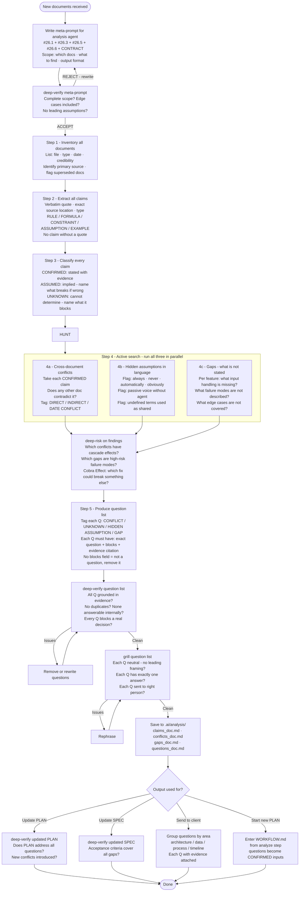

# Document Analysis Process
## Finding gaps, conflicts, hidden assumptions — producing a verified question list

> Purpose: when you receive client documents (requirements, specs, contracts, meeting notes),
> work through them systematically to extract what is confirmed, what is assumed,
> what conflicts, and what is missing — before any planning or implementation begins.
>
> Grounded in: Engineer Soundness & Completeness Theorem (`.ai/theorems/Engineer_Soundness_Completeness.md`)

---

## Why this process exists

AI has a systematic failure mode when analyzing documents:

| AI tendency | What it produces | Theorem violation |
|---|---|---|
| Fills gaps with plausible assumptions | Decisions based on intuition, not evidence | §2 Evidence Sufficiency |
| Accepts the first consistent interpretation | Misses alternative explanations | §3 Root Cause Uniqueness |
| Analyzes each document in isolation | Misses cross-document conflicts | §4 Impact Completeness |
| Stops at stated requirements | Misses implicit constraints and invariants | §5 Invariant Preservation |
| Skips failure modes not explicitly mentioned | Leaves critical scenarios untested | §7 Failure-Mode Coverage |

A question list produced without this process is not a question list — it is a list of things the AI happened to notice while being optimistic.

---

## Process — 6 steps

### Step 1 — Inventory all documents

Before reading anything in depth:

```
DOCUMENTS RECEIVED:
| # | File / source | Type | Date | Credibility |
|---|---|---|---|---|
| D1 | requirements_v2.docx | Requirements | 2026-04-10 | HIGH — signed by client |
| D2 | meeting_notes_tuan.md | Meeting notes | 2026-04-15 | MED — unverified |
| D3 | old_spec_v1.pdf | Previous spec | 2025-11-01 | LOW — superseded? |

PRIMARY SOURCE (highest authority): D1
SECONDARY SOURCES: D2, D3
```

**Rule:** Do not start reading until the inventory is complete and primary source is identified.
Multiple documents with equal authority = first conflict to resolve.

---

### Step 2 — Extract all claims with source citations

Read every document. For every claim, rule, formula, or constraint:

```
CLAIM: "Settlement date must be after purchase date"
SOURCE: D1 page 4, section 3.2 — verbatim: "settlements are processed post-purchase"
TYPE: RULE
STATUS: CONFIRMED
```

Every claim must have:
- verbatim quote (not paraphrase)
- exact source location
- type: RULE / FORMULA / CONSTRAINT / ASSUMPTION / EXAMPLE

**No claim without a quote. No quote = no claim.**

This directly satisfies Theorem §6 (Evidence Completeness):
every artifact must include source of origin and trace to requirement.

---

### Step 3 — Classify every claim: CONFIRMED / ASSUMED / UNKNOWN

Apply the C/A/U taxonomy to every extracted claim:

```
CONFIRMED — explicitly stated in a primary source with verbatim evidence
ASSUMED   — implied but not stated; must include: "if wrong → consequence"
UNKNOWN   — cannot be determined from available documents; blocks a decision
```

**Hard rule:** Every UNKNOWN must name what it blocks.
Every ASSUMED must name what breaks if the assumption is wrong.

This is Theorem §2 (Evidence Sufficiency) made operational:
Accept(h) only if Suff(E(h), h) — no decision based on assumption alone.

---

### Step 4 — Hunt for conflicts and gaps (active search)

This step is not passive reading. It is active search across document pairs.

**4a — Cross-document conflicts**

Take every CONFIRMED claim and ask:
*"Does any other document say something that contradicts this?"*

```
CONFLICT #1:
  Source A: D1 p.4 — "settlement date > purchase date"
  Source B: D2 (meeting notes) — business stakeholder: "we have settlements before the purchase in some cases"
  Type: DIRECT CONTRADICTION
  Consequence if unresolved: settlement filter will exclude valid rows
  Recommendation: D1 is signed, D2 is notes — escalate to the business stakeholder for written clarification
```

**4b — Hidden assumptions in the documents themselves**

Look for language that implies an assumption without stating it:
- "always", "never", "automatically", "obviously", "just", "simply"
- passive voice without agent: "data is loaded", "invoices are processed"
- undefined terms used as if shared: "the settlement", "the report", "the system"

```
HIDDEN ASSUMPTION #1:
  Source: D1 p.7 — "the report is generated automatically"
  Assumption embedded: there is a scheduler; it runs at a known time; it has access to all data
  None of these are stated anywhere
  If wrong: report never runs, or runs on stale data
  Question needed: Q3 (see Step 5)
```

**4c — Gaps (what is not said)**

For every function, formula, or feature described — check what is missing:

```
GAP #1:
  Feature: settlement report
  Stated: what columns appear
  NOT stated: what happens when Warsaw data arrives late
  NOT stated: which date is used when invoice has multiple dates
  NOT stated: how partial settlements are handled
  Consequence: implementation will require assumptions in all three cases
```

This is Theorem §7 (Failure-Mode Coverage):
every failure mode must be covered — gaps are failure modes waiting to happen.

---

### Step 5 — Produce the question list

Every question comes from Step 3 (UNKNOWN), Step 4a (conflict), 4b (hidden assumption), or 4c (gap).

Questions without origin are opinions, not analysis.

```
QUESTION LIST:

Q1. [CONFLICT — D1 vs D2]
    "D1 states settlement date > purchase date. You mentioned in the meeting
     that some settlements precede purchase. Which rule governs the report?
     What should happen to pre-purchase settlements — include, exclude, or flag?"
    BLOCKS: settlement filter implementation
    EVIDENCE: D1 p.4 verbatim + D2 meeting notes verbatim

Q2. [UNKNOWN — formula not defined]
    "What is the exact formula for NET outstanding?
     Is it: gross_outstanding - collected_amount, or gross_outstanding - collected_amount - reserved_amount?"
    BLOCKS: beginning balance calculation, all NET-based rows
    EVIDENCE: D1 p.9 uses 'NET outstanding' 7 times without definition

Q3. [HIDDEN ASSUMPTION — scheduler]
    "D1 says the report is generated automatically. What triggers generation?
     Scheduler? User action? What is the exact time / event?"
    BLOCKS: architecture decision — push vs pull
    EVIDENCE: D1 p.7 — "generated automatically" — no mechanism stated

Q4. [GAP — late data]
    "What should the report show when Warsaw data for a week arrives 2 days late?
     Show the previous week's data? Show empty? Block generation?"
    BLOCKS: error handling design for the pipeline
    EVIDENCE: not mentioned anywhere in D1 or D2
```

Format per question:
- Type tag: `[CONFLICT]` / `[UNKNOWN]` / `[HIDDEN ASSUMPTION]` / `[GAP]`
- Exact question (answerable, not open-ended)
- What it blocks (specific artifact or decision)
- Evidence (document + location)

**A question without "blocks" is not a question — it is a curiosity.**

---

### Step 6 — Verify the question list before sending

Before sending questions to the client or using them to update a plan:

```
Run /deep-verify on the question list:
  - Are all questions grounded in evidence?
  - Are any questions actually the same question asked twice?
  - Are there conflicts that can be resolved internally (no client needed)?
  - Are there questions answerable by re-reading existing documents?

Run /grill on the question list:
  - For each question: is the framing neutral or leading?
  - Does each question have exactly one answer, or could it be misunderstood?
```

Remove any question that:
- has no evidence citation
- is answerable from existing documents
- is two questions pretending to be one
- is a leading question (embeds the expected answer)

This satisfies Theorem §8 (Proof of Correctness):
the question list is only correct if every question is traceable to evidence and blocks a real decision.

---

## Output artifacts

| Artifact | Location | Contains |
|---|---|---|
| Claim inventory | `.ai/analysis/claims_<doc>.md` | All claims with verbatim quotes and source citations |
| C/A/U classification | Inside claim inventory | CONFIRMED / ASSUMED / UNKNOWN per claim |
| Conflict register | `.ai/analysis/conflicts_<doc>.md` | Cross-document contradictions with recommendation |
| Gap register | `.ai/analysis/gaps_<doc>.md` | What is not stated, what it blocks |
| Question list | `.ai/analysis/questions_<doc>.md` | Verified questions with evidence and "blocks" |

---

## Diagram



---

## Theorem mapping — what each step proves

| Step | Theorem condition satisfied |
|---|---|
| Step 1 — Inventory | §6 Evidence Completeness — every artifact has source of origin |
| Step 2 — Extract with verbatim quotes | §2 Evidence Sufficiency — no claim without evidence |
| Step 3 — C/A/U classification | §2 Evidence Sufficiency + §3 Root Cause Uniqueness — assumptions explicit, alternatives named |
| Step 4a — Cross-document conflicts | §3 Root Cause Uniqueness — one valid explanation, alternatives rejected |
| Step 4b — Hidden assumptions | §2 Evidence Sufficiency — no implicit decision |
| Step 4c — Gaps | §7 Failure-Mode Coverage — every missing scenario named |
| Step 5 — Question list with "blocks" | §4 Impact Completeness — all dependencies traced |
| Step 6 — Verify question list | §8 Proof of Correctness — correctness proven within contract |

---

## What makes a question list invalid

| Symptom | Problem | Fix |
|---|---|---|
| Question has no evidence citation | Assumption, not analysis | Find the source or remove |
| Question has no "blocks" field | Curiosity, not a blocker | Name what it blocks or remove |
| Question answerable from existing docs | Lazy reading | Re-read Step 2 |
| Two questions in one sentence | Ambiguous, client will answer only one | Split |
| Leading question ("shouldn't it be X?") | Embeds expected answer | Rephrase as neutral |
| Question about style / preference | Not a gap, not a conflict | Remove |
