# Work Process Diagram

> Paste into https://mermaid.live to render.

```mermaid
flowchart TD
    START([Task arrives]) --> CLASSIFY{Classify task}

    CLASSIFY -->|"Feature / Pipeline / Restore"| NONTRIVIAL
    CLASSIFY -->|"Bugfix - known cause, 1-2 files"| BUGFIX
    CLASSIFY -->|"Trivial / cosmetic"| TRIVIAL

    TRIVIAL --> PF0["preflight<br/>H1-H7 checks with file:line evidence"] --> C0["git commit<br/>imperative · no AI attribution"]

    NONTRIVIAL --> METAPROMPT["Write meta-prompt<br/>#24 + #26.3 + #26.6 + #26.5 + CONTRACT<br/>Define: scope · inputs · outputs · test scenarios · constraints"]
    METAPROMPT --> DV0["deep-verify meta-prompt<br/>Check: completeness · gaps · inconsistencies"]
    DV0 -->|REJECT - rewrite| METAPROMPT
    DV0 -->|ACCEPT| ANALYZE

    ANALYZE["analyze<br/>Extract: CONFIRMED / ASSUMED / UNKNOWN<br/>Stop on any UNKNOWN"] --> UNKNOWNS{UNKNOWNs<br/>remain?}
    UNKNOWNS -->|YES| GRILL["grill<br/>One question at a time<br/>until all UNKNOWNs resolved"]
    GRILL --> UNKNOWNS
    UNKNOWNS -->|NO| DATA_Q

    BUGFIX --> DATA_Q{"Touches data<br/>or formulas?"}
    DATA_Q -->|YES| EVIDENCE["Create validation/name.md + .csv<br/>Ground truth: Treasury · CREST · BQ<br/>Every formula derived from data, not intuition"]
    DATA_Q -->|NO| SPEC_Q
    EVIDENCE --> SPEC_Q{"New feature<br/>needs spec?"}
    SPEC_Q -->|YES| SPEC["Create SPEC_feature.md<br/>Inputs · Outputs · Formula<br/>Edge cases · Acceptance criteria<br/>Verified with business owner"]
    SPEC_Q -->|NO| PLAN
    SPEC --> PLAN

    PLAN["plan → PLAN_feature.md<br/>Decisions with min 2 alternatives<br/>Test scenarios min 14<br/>Invariants as SQL ASSERTs<br/>Stages · Rollback per stage"] --> DV1["deep-verify PLAN_feature.md<br/>Scored findings · adversarial review<br/>REJECT = fix plan, not code"]
    DV1 -->|REJECT - fix plan| FIX1[Fix plan]
    FIX1 --> DV1
    DV1 -->|ACCEPT| RISK{"High-stakes?<br/>restore · finance<br/>multi-country · pipeline"}
    RISK -->|YES| DR["deep-risk PLAN<br/>5D scoring · cascade effects<br/>Cobra Effect check"]
    RISK -->|NO| APPROVED
    DR --> APPROVED

    APPROVED(["PLAN APPROVED<br/>Implementation begins"]) --> STAGE

    STAGE["develop Stage N<br/>Code files listed in PLAN Stage N<br/>No files outside scope"] --> TEST["Run stage test<br/>Exact command from PLAN Stage N"]
    TEST -->|FAIL| FIX2["Fix code<br/>Check invariants"]
    FIX2 --> TEST
    TEST -->|PASS| PASTE["Paste literal output into PLAN<br/>count=34052 · delta=0.00 · HTTP 200<br/>Invariants: I1 pass I2 pass<br/>Status: COMPLETE + timestamp"]
    PASTE --> MORE{"More<br/>stages?"}
    MORE -->|YES| STAGE
    MORE -->|NO| REG

    REG["test verify-existing<br/>Regression · edge cases · arch quality<br/>pytest output pasted as evidence"] --> PF["preflight<br/>H1-H7 · C1-C3 · NULL semantics<br/>file:line evidence per check"]
    PF -->|BLOCK - fix violations| FIX3[Fix violations]
    FIX3 --> PF
    PF -->|READY TO COMMIT| COMMIT["git commit<br/>Imperative English · no AI attribution<br/>References stage / PLAN"]
    COMMIT --> PR["gh pr create<br/>Changes summary · test evidence linked<br/>Rollback documented"]
    PR --> REVIEW["review<br/>CONTRACT discipline<br/>Disclosure checkpoints verified"]
    REVIEW -->|Issues| FIX4[Fix and re-preflight]
    FIX4 --> REVIEW
    REVIEW -->|Approved| MERGE(["Merge ✓"])

    MERGE --> CLOSE["PLAN Status → COMPLETE<br/>TODO entry closed<br/>validation files kept as permanent record"]
    CLOSE --> LESSON{"Lesson<br/>generalizable?<br/>Rule of three?"}
    LESSON -->|YES| CODIFY["Codify the lesson:<br/>templates/HOWTO → repeatable procedure<br/>standards.md → code rule<br/>CONTRACT.md → AI behavior rule<br/>hooks/standards-check.sh → exit 2 block"]
    LESSON -->|NO| DONE(["Done ✓"])
    CODIFY --> DONE
```

---

## Gates — cannot skip

| Gate | Blocks what |
|---|---|
| deep-verify meta-prompt: ACCEPT | Starting analyze |
| deep-verify PLAN: ACCEPT | Starting develop |
| Stage hard evidence pasted | Moving to next stage |
| preflight: READY | Committing |
| review: Approved | Merging |

---

## Test scenarios — minimum count by task type

| Task type | Min scenarios | Breakdown |
|---|---|---|
| Feature / Pipeline / Restore | 14 | 1 happy + 4 edge + 7 boundary + 4 failure + 2 regression |
| Bugfix | 3 | 1 happy + 1 edge + 1 regression |
| UI-only | 3 | 1 happy + 1 edge + 1 regression screenshot |
