# Forge — Kompletny Diagram Procesu

## 1. Przepływ Główny (High-Level)

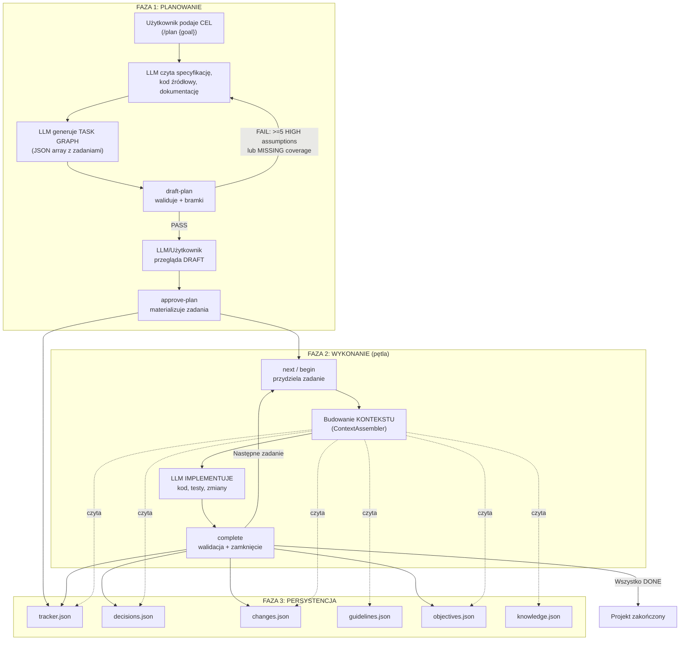

---

## 2. Co LLM Otrzymuje i Musi Dostarczyć na Każdym Etapie

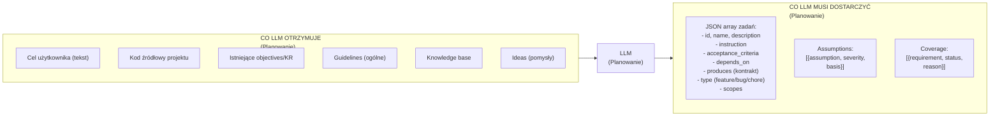

```mermaid
flowchart LR
    subgraph INPUT_EXEC["CO LLM OTRZYMUJE\n(Wykonanie zadania)"]
        E1["Task detail:\nname, description,\ninstruction, AC, produces"]
        E2["Alignment contract:\ngoal, must/must_not"]
        E3["Exclusions (DO NOTs)"]
        E4["Guidelines MUST\n(zawsze, priorytet 1)"]
        E5["Guidelines SHOULD\n(jeśli mieści się w oknie)"]
        E6["Knowledge\n(explicit + scope-matched)"]
        E7["Dependency context:\nproduces + changes\nz ukończonych tasków"]
        E8["Decisions\n(OPEN, affecting)"]
        E9["Business context:\nObjective + KR progress"]
        E10["Active Risks"]
        E11["Plan staleness warnings"]
    end

    subgraph OUTPUT_EXEC["CO LLM MUSI DOSTARCZYĆ\n(Wykonanie)"]
        X1["Implementacja kodu"]
        X2["--reasoning\n(dlaczego tak zrobiono)"]
        X3["--ac-reasoning\n'AC 1: [kryterium] —\nPASS: [dowód]'"]
        X4["--deferred\n[{requirement, reason}]\n(opcjonalnie)"]
        X5["Przejście bramek\n(testy, lint)"]
    end

    INPUT_EXEC --> LLM_E["LLM\n(Wykonanie)"]
    LLM_E --> OUTPUT_EXEC
```

---

## 3. Szczegółowy Przepływ Danych: draft-plan

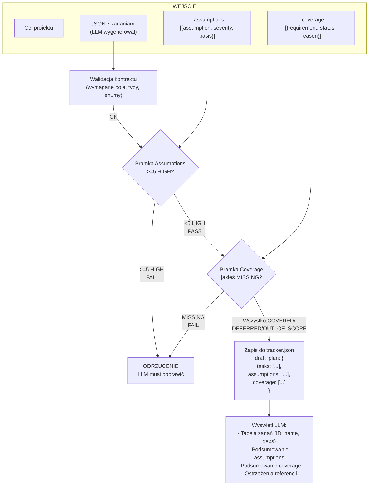

---

## 4. Szczegółowy Przepływ: approve-plan

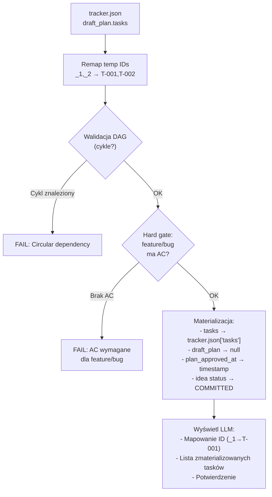

---

## 5. Szczegółowy Przepływ: begin / next (Context Assembly)

```mermaid
flowchart TB
    NEXT_CMD["next {project}"] --> FIND_TASK{"Znajdź TODO task:\n1. Deps spełnione?\n2. Brak konfliktów?\n3. Brak blocking decisions?"}
    FIND_TASK -->|"Znaleziono"| CLAIM["Claim task\n(2-phase dla multi-agent)"]
    FIND_TASK -->|"Brak"| NO_TASK["Brak dostępnych tasków"]

    CLAIM --> SET_STATUS["status → IN_PROGRESS\nagent → {name}\nstarted_at → timestamp\nstarted_at_commit → git SHA"]

    SET_STATUS --> GIT_BRANCH["Git: utwórz branch\n(opcjonalnie worktree)"]

    GIT_BRANCH --> BUILD_CONTEXT["ContextAssembler\nbuduje kontekst"]

    subgraph CONTEXT_SECTIONS["Sekcje kontekstu (priorytet)"]
        direction TB
        P1_TASK["P1: Task content\n(name, desc, instruction, AC,\nscopes, produces, alignment,\nexclusions)\nNIGDY nie obcinane"]
        P1_MUST["P1: Guidelines MUST\nmax 10% okna\nNIGDY nie obcinane"]
        P2_KNOW_REQ["P2: Knowledge required\n(explicit knowledge_ids)\nmax 15%"]
        P3_KNOW_CTX["P3: Knowledge context\n(scope-matched, max 10)\nmax 10%, obcinalne"]
        P4_SHOULD["P4: Guidelines SHOULD\nmax 10%, obcinalne\nPominięte jeśli total > 80%"]
        P5_DEPS["P5: Dependency context\n(produces + changes z deps)\nmax 10%, obcinalne"]
        P6_RISKS["P6: Active risks\nmax 5%, obcinalne"]
        P7_BIZ["P7: Business context\n(Objective + KR progress)\nmax 5%, obcinalne"]
        P8_TESTS["P8: Test context\n(test/lint commands, gates)\nmax 5%, obcinalne"]

        P1_TASK --> P1_MUST --> P2_KNOW_REQ --> P3_KNOW_CTX
        P3_KNOW_CTX --> P4_SHOULD --> P5_DEPS --> P6_RISKS --> P7_BIZ --> P8_TESTS
    end

    BUILD_CONTEXT --> CONTEXT_SECTIONS

    CONTEXT_SECTIONS --> TOKEN_BUDGET["Token Budget:\n- 25% zarezerwowane na output\n- Per-section max_pct caps\n- Overflow: usuń najniższy priorytet"]

    TOKEN_BUDGET --> DELIVER["Dostarcz do LLM:\nMarkdown z wszystkimi sekcjami"]
```

---

## 6. Skąd Pochodzą Dane Kontekstu

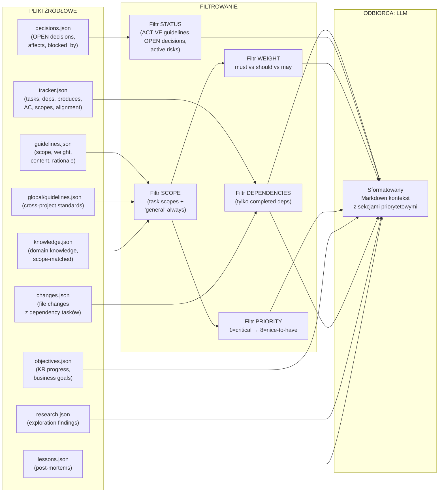

---

## 7. Przepływ complete — Walidacja i Zamknięcie

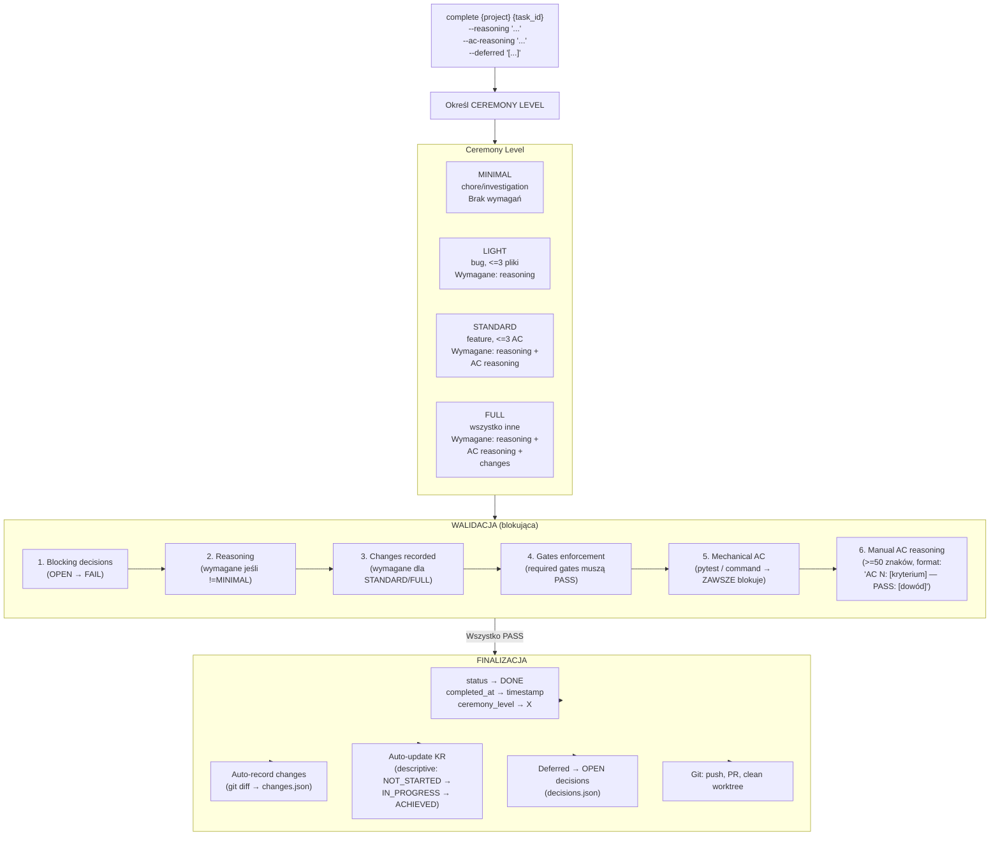

---

## 8. Przepływ AC (Acceptance Criteria)

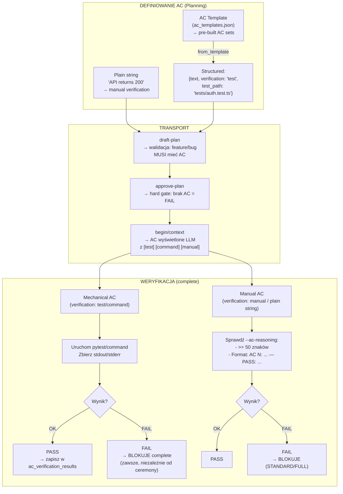

---

## 9. Przepływ Guidelines

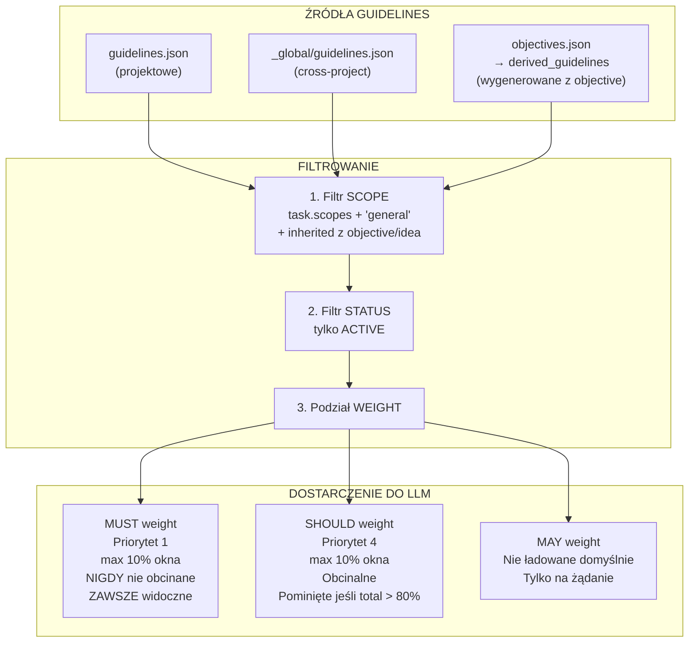

---

## 10. Przepływ Objectives / KR → Tasks

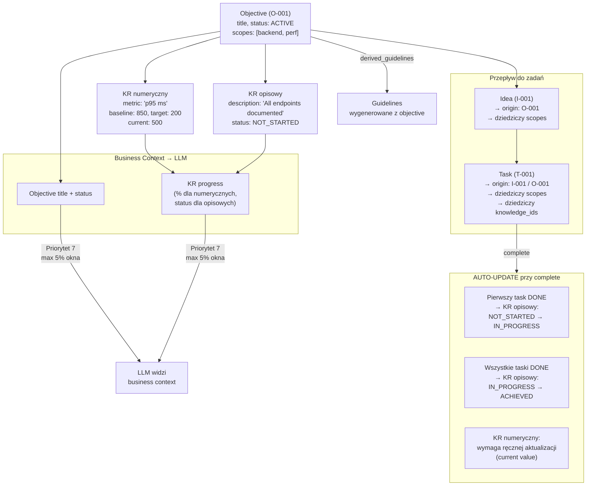

---

## 11. Przepływ Decisions

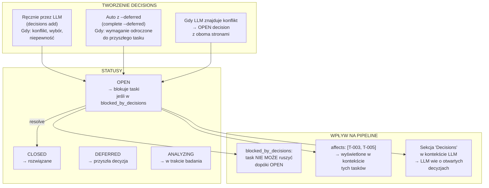

---

## 12. Przepływ Gates

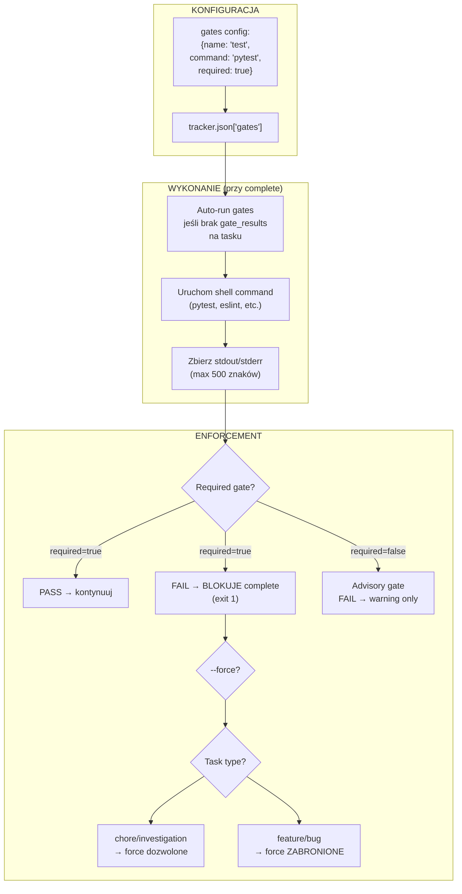

---

## 13. Pełna Mapa: Co Skąd Trafia Do LLM

```mermaid
flowchart TB
    subgraph USER["UŻYTKOWNIK"]
        U_GOAL["Cel / specyfikacja"]
        U_FEEDBACK["Feedback / korekty"]
        U_APPROVE["Approve / reject"]
    end

    subgraph FILES["PLIKI FORGE (forge_output/)"]
        F_TRACKER["tracker.json"]
        F_DECISIONS["decisions.json"]
        F_CHANGES["changes.json"]
        F_GUIDELINES["guidelines.json"]
        F_OBJECTIVES["objectives.json"]
        F_KNOWLEDGE["knowledge.json"]
        F_RESEARCH["research.json"]
        F_LESSONS["lessons.json"]
        F_AC_TEMPL["ac_templates.json"]
        F_GLOBAL["_global/guidelines.json"]
    end

    subgraph GIT["GIT"]
        G_DIFF["git diff\n(changed files)"]
        G_SHA["git rev-parse HEAD\n(commit SHA)"]
        G_BRANCH["branch management"]
    end

    subgraph PIPELINE["PIPELINE (core/pipeline.py)"]
        CMD_DRAFT["draft-plan"]
        CMD_APPROVE["approve-plan"]
        CMD_NEXT["next"]
        CMD_BEGIN["begin"]
        CMD_CONTEXT["context\n(ContextAssembler)"]
        CMD_COMPLETE["complete"]
    end

    subgraph LLM["LLM (Claude)"]
        LLM_PLAN["Planuje:\n→ Task JSON + deps\n→ Assumptions\n→ Coverage"]
        LLM_EXEC["Wykonuje:\n→ Kod źródłowy\n→ Testy\n→ Reasoning\n→ AC reasoning\n→ Deferred items"]
        LLM_DECIDE["Decyduje:\n→ Decisions (konflikty)\n→ Changes (opis zmian)\n→ Korekty planu"]
    end

    %% User → Pipeline
    U_GOAL -->|"/plan"| CMD_DRAFT
    U_FEEDBACK -->|"iteracja"| CMD_DRAFT
    U_APPROVE -->|"/approve"| CMD_APPROVE

    %% Files → Context
    F_TRACKER -->|"tasks, deps,\nproduces, AC"| CMD_CONTEXT
    F_DECISIONS -->|"OPEN decisions,\naffects"| CMD_CONTEXT
    F_GUIDELINES -->|"scope-filtered,\nMUST/SHOULD"| CMD_CONTEXT
    F_GLOBAL -->|"cross-project\nstandards"| CMD_CONTEXT
    F_KNOWLEDGE -->|"explicit +\nscope-matched"| CMD_CONTEXT
    F_OBJECTIVES -->|"KR progress,\nbusiness goals"| CMD_CONTEXT
    F_CHANGES -->|"dependency\nchanges"| CMD_CONTEXT
    F_RESEARCH -->|"exploration\nfindings"| CMD_CONTEXT
    F_LESSONS -->|"past lessons"| CMD_CONTEXT
    F_AC_TEMPL -->|"AC templates"| CMD_DRAFT

    %% Pipeline → LLM
    CMD_DRAFT -->|"draft summary,\ntask table,\nassumptions,\ncoverage"| LLM_PLAN
    CMD_CONTEXT -->|"priorytetowy\nMarkdown kontekst"| LLM_EXEC
    CMD_COMPLETE -->|"gate results,\nAC verification,\nceremony level"| LLM_EXEC

    %% LLM → Pipeline
    LLM_PLAN -->|"task JSON"| CMD_DRAFT
    LLM_EXEC -->|"--reasoning\n--ac-reasoning\n--deferred"| CMD_COMPLETE
    LLM_DECIDE -->|"decisions add"| F_DECISIONS
    LLM_DECIDE -->|"changes record"| F_CHANGES

    %% Pipeline → Files
    CMD_APPROVE -->|"materialize tasks"| F_TRACKER
    CMD_COMPLETE -->|"status=DONE"| F_TRACKER
    CMD_COMPLETE -->|"auto-record"| F_CHANGES
    CMD_COMPLETE -->|"deferred→OPEN"| F_DECISIONS
    CMD_COMPLETE -->|"KR auto-update"| F_OBJECTIVES

    %% Git
    G_DIFF -->|"changed files"| CMD_COMPLETE
    G_SHA -->|"started_at_commit"| CMD_NEXT
    CMD_NEXT -->|"create branch"| G_BRANCH
    CMD_COMPLETE -->|"push, PR"| G_BRANCH
```

---

## 14. Token Budget — Jak ContextAssembler Zarządza Oknem

```
┌──────────────────────────────────────────────────────────┐
│                    CONTEXT WINDOW (100%)                  │
├──────────────────────────────────────────────────────────┤
│                                                          │
│  ┌─────────────────────────────────────────────────┐     │
│  │         AVAILABLE FOR INPUT (75%)                │     │
│  │                                                  │     │
│  │  P1: Task content          [max 30%] PROTECTED  │     │
│  │  P1: MUST guidelines       [max 10%] PROTECTED  │     │
│  │  P2: Required knowledge    [max 15%]            │     │
│  │  P3: Context knowledge     [max 10%] obcinalne  │     │
│  │  P4: SHOULD guidelines     [max 10%] obcinalne  │     │
│  │  P5: Dependency context    [max 10%] obcinalne  │     │
│  │  P6: Active risks          [max  5%] obcinalne  │     │
│  │  P7: Business context      [max  5%] obcinalne  │     │
│  │  P8: Test context          [max  5%] obcinalne  │     │
│  │                                                  │     │
│  │  Overflow → usuń od P8 w górę                   │     │
│  │  SHOULD pominięte jeśli total > 80%             │     │
│  └─────────────────────────────────────────────────┘     │
│                                                          │
│  ┌─────────────────────────────────────────────────┐     │
│  │         RESERVED FOR OUTPUT (25%)                │     │
│  │         (LLM response space)                     │     │
│  └─────────────────────────────────────────────────┘     │
│                                                          │
└──────────────────────────────────────────────────────────┘

Estymacja tokenów: chars / 4 (heurystyka bez tokenizera)
```

---

## 15. Tabela Podsumowująca: Etap → Wejście → LLM Action → Wyjście

| Etap | Co LLM otrzymuje | Co LLM musi zrobić | Co LLM musi dostarczyć | Gdzie trafia wynik |
|------|---|---|---|---|
| **`/plan`** | Cel użytkownika, kod, objectives, knowledge | Zaprojektować graf zadań | JSON array: tasks z AC, deps, produces, scopes + assumptions + coverage | `draft-plan` → `tracker.json[draft_plan]` |
| **`draft-plan` review** | Tabela tasków, podsumowanie assumptions/coverage, ostrzeżenia | Przejrzeć, skorygować | Poprawiony JSON lub potwierdzenie | `approve-plan` → `tracker.json[tasks]` |
| **`begin`** | Task detail + pełny kontekst (guidelines, knowledge, deps, risks, business) | Zrozumieć zadanie, ograniczenia, kontrakty | — (przejście do implementacji) | — |
| **Implementacja** | Kontekst z begin + kod źródłowy | Napisać kod, testy, spełnić AC | Pliki kodu, testy | Git (working tree) |
| **`complete`** | Ceremony level, gate results, AC verification | Podsumować pracę, udowodnić AC | `--reasoning`, `--ac-reasoning`, `--deferred` | `tracker.json`, `changes.json`, `decisions.json`, `objectives.json` |
| **Decisions** | Konflikt lub niepewność | Opisać obie strony, zaproponować | Decision JSON (type, options, recommendation) | `decisions.json` |
| **Changes** | Git diff | Opisać co i dlaczego zmieniono | Change records (auto z git) | `changes.json` |

---

## Legenda

- **P1–P8** — priorytety sekcji kontekstu (1 = najwyższy, nigdy nie obcinany)
- **MUST/SHOULD/MAY** — wagi guidelines (MUST = obowiązkowe, SHOULD = zalecane, MAY = opcjonalne)
- **Ceremony** — poziom formalności completion (MINIMAL < LIGHT < STANDARD < FULL)
- **Gate** — mechaniczny test (command) uruchamiany przy complete
- **AC** — Acceptance Criteria (kryteria akceptacji zadania)
- **KR** — Key Result (mierzalny wynik powiązany z Objective)
- **Produces** — kontrakt semantyczny: co task dostarcza downstream tasków
