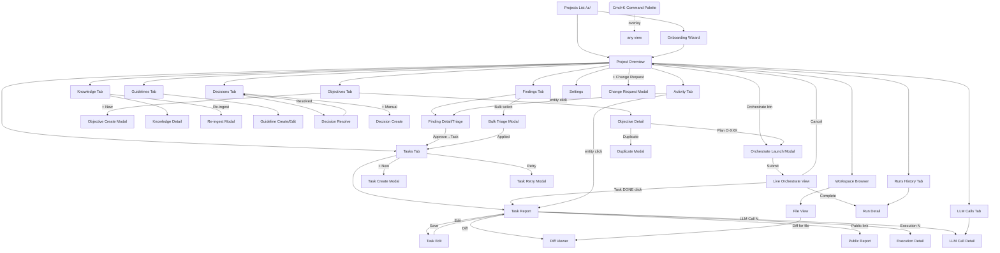

# UX — mapa widoków

Cel: jeden dokument pokazujący wszystkie widoki (obecne + proponowane), jak się między sobą łączą, i co każdy robi. Szczegółowe mockupy w `UX_MOCKUPS.md`.

---

## 1. Status obecnych widoków

Obecne (5):
1. `GET /ui/` — Projects list
2. `GET /ui/projects/{slug}` — Project detail z 6 tabów
3. `GET /ui/projects/{slug}/tasks/{ext}` — Task report (DONE)
4. `GET /ui/llm-calls/{id}` — LLM call detail
5. Modale HTMX — inline, nie osobny URL

Luki: brak edycji, brak live orchestrate, brak findings triage UI, brak guidelines, brak workspace, brak activity, brak command palette.

---

## 2. Lista wszystkich widoków w propozycji

### Globalne (bez projektu)
- **G1. Projects List** `/ui/` — lista projektów + create wizard + "since last visit" badge per kafelek
- **G2. Global Settings** `/ui/settings` — dark mode, keyboard shortcuts reference, user email (z MEMORY.md)
- **G3. Command Palette** overlay (Cmd+K), nie URL — fuzzy search dla akcji i nawigacji

### Per-project (główny kontekst)
- **P1. Project Overview** `/ui/projects/{slug}` — landing projektu, pokazuje stan + następny krok + 7 tabów
- **P2. Project Settings** `/ui/projects/{slug}/settings` — edit name/goal/config, delete, budget limits
- **P3. Change Request Modal** — nowy wymóg z impact preview (overlay)
- **P4. Onboarding Wizard** `/ui/projects/new` — 3 kroki dla greenfield

### Objectives
- **O1. Objectives Tab** `/ui/projects/{slug}?tab=objectives` — lista
- **O2. Objective Detail** `/ui/projects/{slug}/objectives/{ext}` — full view z KR edit
- **O3. Objective Create Modal** — formularz manualny
- **O4. Objective Duplicate Modal** — cross-project

### Tasks
- **T1. Tasks Tab** `/ui/projects/{slug}?tab=tasks` — tabela z filtrami, multi-select
- **T2. Task Detail** `/ui/projects/{slug}/tasks/{ext}/edit` — edit mode (instruction + AC + deps + refs)
- **T3. Task Report** `/ui/projects/{slug}/tasks/{ext}` — DONE report (obecny, rozbudowany)
- **T4. Task Create Modal** — add ad-hoc task
- **T5. Task Diff Viewer** `/ui/projects/{slug}/tasks/{ext}/diff` — unified git diff per task
- **T6. Task Retry Modal** — retry z opcjonalnym hintem

### Acceptance Criteria
- **AC1. AC Editor** — embedded w Task Detail (T2), repeater z dodaj/usuń/reorder

### Knowledge
- **K1. Knowledge Tab** `/ui/projects/{slug}?tab=knowledge` — lista + upload + wkleić
- **K2. Knowledge Detail** `/ui/projects/{slug}/knowledge/{ext}` — full markdown render + edit
- **K3. Re-ingest Modal** — replace / version up

### Guidelines (nowy tab)
- **Gu1. Guidelines Tab** `/ui/projects/{slug}?tab=guidelines` — global + per-project
- **Gu2. Guideline Create/Edit Modal**

### Decisions
- **D1. Decisions Tab** `/ui/projects/{slug}?tab=decisions` — lista z filtrem status
- **D2. Decision Detail + Resolve Modal** — pełny reasoning, alternatives, resolve form
- **D3. Decision Create Modal** — manual

### Findings
- **F1. Findings Triage Board** `/ui/projects/{slug}?tab=findings` — kanban-like albo tabela z multi-select + bulk actions
- **F2. Finding Detail + Triage Modal** — approve (create task lub link to existing) / defer / reject
- **F3. Bulk Triage Modal** — dla multi-select

### Orchestration
- **X1. Orchestrate Launch Modal** — max_tasks, stop_on_failure, budget_guard, infra
- **X2. Live Orchestrate View** `/ui/projects/{slug}/runs/{run_id}` — SSE live, progress, cancel
- **X3. Orchestrate Runs History** `/ui/projects/{slug}?tab=runs` — past runs
- **X4. Run Detail** `/ui/projects/{slug}/runs/{run_id}?view=history` — raport z zakończonego runu

### Executions & LLM
- **E1. LLM Calls Tab** `/ui/projects/{slug}?tab=llm-calls` — obecny, rozszerzyć filtry
- **E2. LLM Call Detail** `/ui/llm-calls/{id}` — obecny
- **E3. Execution Detail** `/ui/executions/{id}` — prompt + validation + attempts + delivery
- **E4. Activity Timeline** `/ui/projects/{slug}?tab=activity` — cross-entity audit log

### Workspace
- **W1. Workspace File Browser** `/ui/projects/{slug}/workspace` — tree + content viewer
- **W2. Workspace File View** `/ui/projects/{slug}/workspace/files/{path}` — pojedynczy plik

### Public / Export
- **PU1. Task Report Public View** `/ui/projects/{slug}/tasks/{ext}?public=1` — ukrywa edit, export PDF/MD

---

## 3. Mapa nawigacji (Mermaid)

---

## 4. Per-view specification

### G1. Projects List `/ui/`
- **Purpose:** wybór projektu + szybki overview stanu wszystkich.
- **Info shown:** kafelki z nazwą, slug, goal (skrót), stats (tasks total/done/failed, findings HIGH count), **"since last visit"** diff (+N DONE, +N findings), total cost, last activity timestamp.
- **Key actions:** + New project (→ P4), search/filter, sort (recency, name, cost), click kafelek (→ P1).
- **Empty state:** "Nie masz jeszcze projektu" + CTA + 1-linkowa wskazówka.
- **Entry:** landing, logo click.
- **Exit:** click kafelek → P1.

### G3. Command Palette (Cmd+K)
- **Purpose:** szybki dostęp do akcji i nawigacji bez klikania.
- **Info shown:** fuzzy search input, lista 20 top akcji (sortowanych po recent + frequency), grupy: Nawigacja, Akcja na projekcie, Akcja na tasku (jeśli kontekst), Wyszukaj X.
- **Key actions:** ingest, analyze, plan O-XXX, orchestrate, retry T-XXX, resolve D-XXX, triage F-XXX, go to task X, re-run execution N.
- **Entry:** Cmd+K / Ctrl+K z każdego widoku.
- **Exit:** Esc / akcja wykonana.

### P1. Project Overview
- **Purpose:** centralny hub projektu, "co się dzieje i co mam zrobić dalej".
- **Info shown:**
  - Header: name + slug + goal (inline editable)
  - "Since last visit" banner (jeśli >2h od ostatniej wizyty)
  - Stats grid (4 karty): Tasks (total/done/todo/failed/running), Objectives (count/achieved), Cost (total/by-purpose/budget-remaining), Findings/Decisions (open HIGH/MEDIUM)
  - **"Next step" suggestion** — AI-heurystyka w backendzie: jeśli brak Knowledge → Ingest; jeśli brak Objectives → Analyze; jeśli Objective bez Plan → Plan; jeśli TODO tasks → Orchestrate; jeśli OPEN HIGH decisions → Resolve; jeśli failed tasks → Retry
  - Pasek akcji: Ingest | Analyze | Plan [O-dropdown] | Orchestrate | + Change Request | Cmd+K
  - Tabs: Objectives | Tasks | Knowledge | Guidelines | Decisions | Findings | LLM Calls | Activity | Runs
- **Key actions:** wszystkie triggery faz, nawigacja do każdego tab'u, edit goal inline.
- **Entry:** z G1, z breadcrumb, z notification.
- **Exit:** → tabs, → settings, → back do G1.

### P3. Change Request Modal
- **Purpose:** wprowadzić nowy/zmieniony wymóg w trakcie projektu bez psucia struktury.
- **Info shown:** 3 tab'y (Nowy wymóg / Scope change / Clarification), textarea, impact preview (LLM-generated), lista proponowanych zmian z checkboxami (user odznacza co odrzuca).
- **Key actions:** Generate impact (wywołuje LLM), Apply selected, Cancel, Save as draft.
- **Entry:** globalny btn "+ Change Request" w P1.
- **Exit:** Apply → P1 z toastem; Cancel → P1.

### P4. Onboarding Wizard
- **Purpose:** prowadzi nowego usera od 0 do "analyze in progress" bez myślenia.
- **Info shown:** 3 kroki w stepper — (1) Basic info, (2) Source documents upload lub "skip", (3) Next steps z wyjaśnieniem + CTA "Analyze teraz" albo "Zrobię to później".
- **Key actions:** next, back, finish, skip upload.
- **Entry:** G1 "+ New project" (zamiast inline form).
- **Exit:** finish → P1.

### O2. Objective Detail
- **Purpose:** zobaczyć + edytować objective z KRs i related tasks.
- **Info shown:** title + status + priority (inline editable), business_context (markdown), scopes (tag editor), KR list z inline edit (text, type, target_value, measurement_command, status, current_value), related tasks (lista z statusem), progress bar (% KR achieved).
- **Key actions:** edit title/context/priority, add KR, delete KR, measure KR now, plan (jeśli brak tasków), duplicate to another project, archive.
- **Entry:** O1 click, breadcrumb.
- **Exit:** breadcrumb, task link → T3.

### T1. Tasks Tab
- **Purpose:** przeglądać, filtrować, wykonywać bulk actions na tasks.
- **Info shown:** tabela: checkbox | ID | name | type | status | origin (O-NNN link) | AC count | req_refs count | KR links | duration | cost | last activity.
- **Key actions:** filter by status/type/origin/scope, search by name, multi-select + bulk (retry, skip, delete), sort (default: id asc), + New task (→ T4), click row → T3.
- **Entry:** P1 → tab.
- **Exit:** click row.

### T2. Task Detail (Edit)
- **Purpose:** edytować WSZYSTKIE pola zanim task się wykona (lub po failure).
- **Info shown:**
  - Header: ID, name, type (select), status, origin (select objective)
  - Instruction (markdown editor, resizable)
  - AC repeater: position | text | scenario_type | verification (test/command/manual) | test_path (z autocomplete z workspace file tree) | command | [delete]
  - Requirement refs (tag input z autocomplete po Knowledge external_ids + "§X.Y")
  - Completes KR (multi-select KRs z origin objective)
  - Depends on (multi-select tasks z tego projektu)
  - Scopes (tag editor)
  - Produces (JSON editor, prosty textarea z walidacją)
  - Exclusions (list)
  - Generate scenarios btn (wypełnia AC z heurystyki)
- **Key actions:** save, save & retry, cancel, delete task.
- **Entry:** T1 click, T3 "Edit" btn.
- **Exit:** save → T3 lub T1.

### T3. Task Report (obecny, rozbudowany)
- **Purpose:** trustworthy DONE report + akcje.
- **Info shown (dodatkowe do dzisiejszego):**
  - Breadcrumb Project / Tasks / T-XXX
  - Top actions bar: [Edit] [Retry] [Diff] [Export MD] [Public link]
  - Sticky TOC po lewej (Requirements, Objective+KR, Tests, Challenge, Findings, Decisions, AC, Not-executed, Attempts)
- **Key actions:** edit → T2, retry → T6, diff → T5, triage finding inline, resolve decision inline, copy public link.
- **Entry:** T1 click, notification, email link.
- **Exit:** breadcrumb, related link.

### T5. Task Diff Viewer
- **Purpose:** zobaczyć co Claude FIZYCZNIE zmienił (git diff), nie tylko "summary" z delivery.
- **Info shown:** file tree po lewej (pliki zmienione), unified diff po prawej z syntax highlight, kolorowanie (+/-), nawigacja F/G/Backspace między plikami.
- **Key actions:** switch file, toggle "show unchanged", copy diff, download patch.
- **Entry:** T3 "Diff" btn, commit hash link.
- **Exit:** breadcrumb.

### T6. Task Retry Modal
- **Purpose:** ponownie uruchomić failed task z poprawionym promptem.
- **Info shown:** current instruction (read-only preview), "dodatkowa wskazówka" textarea, zmiana modelu (executor/challenger select), budget cap, "retry all failed deps" checkbox.
- **Key actions:** retry now, cancel.
- **Entry:** T3 "Retry" btn, T1 row menu.

### K2. Knowledge Detail
- **Purpose:** przeczytać pełny dokument, oznaczyć, edytować.
- **Info shown:** title + category + version + status + scopes, full markdown rendered, meta (source_type, source_ref, created_at, created_by).
- **Key actions:** edit (inline), deprecate, version up (z re-ingest modal), duplicate to another project.
- **Entry:** K1 click.
- **Exit:** breadcrumb.

### D2. Decision Resolve
- **Purpose:** rozwiązać OPEN decision z pełnym kontekstem.
- **Info shown:** issue (full), recommendation, reasoning, alternatives_considered (jeśli są — side-by-side), related source docs fragmenty (jeśli conflict między SRC-X i SRC-Y — pokaż oba fragmenty), related tasks.
- **Key actions:** Accept recommendation, Modify + accept, Defer with reason, Reject with reason. Keyboard: 1/2/3/J/K.
- **Entry:** D1 click, notification.
- **Exit:** resolved → D1.

### F1. Findings Triage Board
- **Purpose:** zatriagować wszystkie OPEN findings efektywnie.
- **Info shown:** default view = tabela z kolumnami (checkbox, ext_id, severity, type, title, source, file_path, suggested_action, created_at). Alternative view = kanban (columns OPEN/APPROVED/DEFERRED/REJECTED). Filter chips: severity (HIGH/MED/LOW), source (extractor/challenger), type, status. Sort: default severity DESC + date DESC.
- **Key actions:** multi-select → bulk (approve all → 4 tasks; defer all; reject all), single action buttons inline, click row → F2.
- **Entry:** P1 tab, notification "4 findings HIGH".
- **Exit:** F2, task created link → T1.

### F2. Finding Detail + Triage Modal
- **Purpose:** zdecydować co zrobić z konkretnym finding.
- **Info shown:** full title, description, evidence (z source — extractor/challenger badge), file_path + line_number, suggested_action, related task (jeśli jest).
- **Key actions:**
  - **Approve → Create new task**: modal z pre-wypełnionym name/instruction; user może edit przed utworzeniem
  - **Approve → Link to existing task**: select z lista tasków projektu
  - **Defer**: z reason
  - **Reject**: z reason
- **Entry:** F1 click.

### X1. Orchestrate Launch Modal
- **Purpose:** uruchomić orchestrate z sensownymi parametrami + budget guard.
- **Info shown:** max_tasks (domyślnie = count TODO deps-met), stop_on_failure, skip_infra (z ostrzeżeniem), enable_redis, model override (executor/challenger), **budget cap** (estymacja * 1.3; user ustawia twarde `max_cost_usd`), lista tasków które wejdą w kolejkę z estymacją czasu/kosztu.
- **Key actions:** Launch, Cancel, Save as preset.
- **Entry:** P1 Orchestrate btn, Cmd+K "orchestrate".

### X2. Live Orchestrate View
- **Purpose:** watchujący task widzi co się dzieje w czasie rzeczywistym.
- **Info shown:**
  - Top bar: run_id, elapsed time, total cost (tick co 2s), "Cancel run" btn (czerwony), budget pasek (zielony/żółty/czerwony)
  - Lewa strona: lista tasków w kolejce z stanami (pending / running / done / failed). Running podświetlony.
  - Środek: dla currently running — per-phase progress (Prompt assembled → Claude CLI running → Delivery received → Validation → Phase A tests → KR measure → Phase B extract → Phase C challenge) z tick/cross ikonami
  - Prawa: live log tail (SSE) — ostatnie 50 lines, auto-scroll toggle
  - Dół: timeline eventów (kluczowe, nie każdy log line)
- **Key actions:** Cancel current task (bez abortu całego run), Cancel run, skip current task, "stop po tym task", zamknij kartę (run leci dalej w tle).
- **Entry:** X1 submit, notification "run in progress".
- **Exit:** complete → X4; cancel → P1.

### X4. Run Detail (historical)
- **Purpose:** przejrzeć zakończony run — co poszło dobrze/źle, ile kosztowało.
- **Info shown:** aggregated summary, per-task status + attempts + cost, timeline re-playable, link do każdego task_report.
- **Entry:** X3 click, X2 complete.

### E3. Execution Detail
- **Purpose:** debug — pokazać CO dokładnie agent dostał i co zwrócił.
- **Info shown:** full prompt (expand/collapse sections z prompt_sections), contract dostarczony, delivery raw, validation_result z failed checks podświetlonymi, prompt_elements lista z included/excluded i reason.
- **Key actions:** copy prompt, re-run identical, view LLM call row.
- **Entry:** T3 attempts list, E1 row, Activity timeline.

### E4. Activity Timeline
- **Purpose:** co się zdarzyło kiedy, kto zrobił.
- **Info shown:** chronologiczny feed: timestamp | entity | action | actor | delta preview. Filters: entity_type, actor, date range.
- **Key actions:** click entity → go to entity view.
- **Entry:** P1 tab, "Since last visit" → "pokaż wszystko".

### W1. Workspace File Browser
- **Purpose:** zobaczyć fizyczny workspace co Claude utworzył.
- **Info shown:** tree widget (foldery/pliki, size, modified), toolbar (refresh, collapse all, search in files).
- **Key actions:** click plik → W2, download zip, "run tests here" (opcjonalnie).
- **Entry:** P1 link z dolnej części, T3 "workspace" link.

### W2. Workspace File View
- **Purpose:** przeczytać zawartość pliku z syntax highlight.
- **Info shown:** path breadcrumb, file content, line numbers, "which task created this" (mapa z git log).
- **Key actions:** copy, download, "diff since last run".
- **Entry:** W1.

---

## 5. Stałe wzorce nawigacyjne

### Breadcrumbs
Na każdym widoku poza G1 i X2 (live — fullscreen):
`Forge / projects / warehouseflow / tasks / T-007`

### Prawy górny róg
- Project slug link (breadcrumb back)
- User email (z MEMORY.md)
- Theme toggle (dark/light)
- Cmd+K hint "⌘K"

### Notyfikacje
- Toast top-right dla akcji udanych (auto-dismiss 4s)
- Persistent banner dla błędów (dismiss ręczny)
- Red dot na navbar dla findings HIGH i failed tasks
- **Nie dodaję pełnego notification center** — to już over-engineering dla tej klasy tool'a. Flag jako out-of-scope MVP.

### Keyboard shortcuts
- Cmd+K — command palette
- ? — pokaż skróty
- J/K — next/prev w listach
- G then P — go to projects
- G then T — go to tasks tab
- G then F — go to findings
- E — edit (kontekst dependent)
- Esc — close modal

Dokumentacja skrótów → G2 (Settings).
