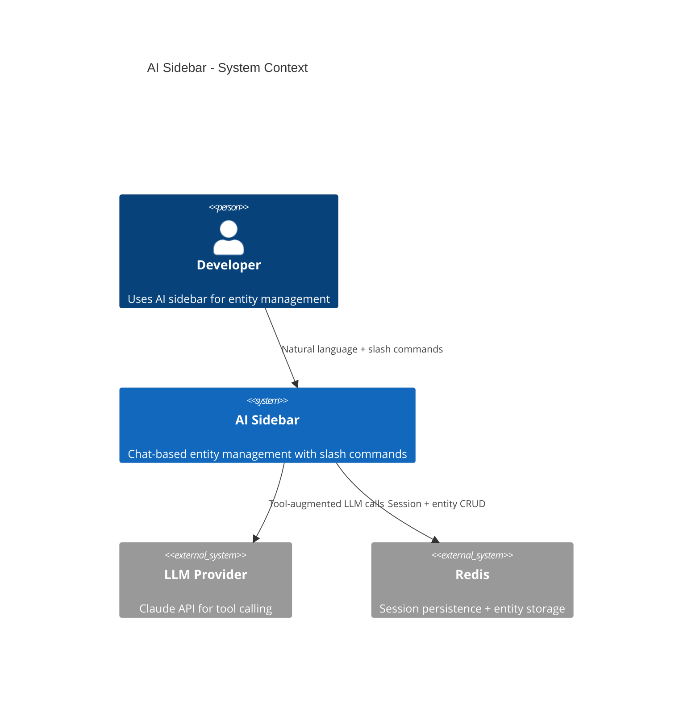
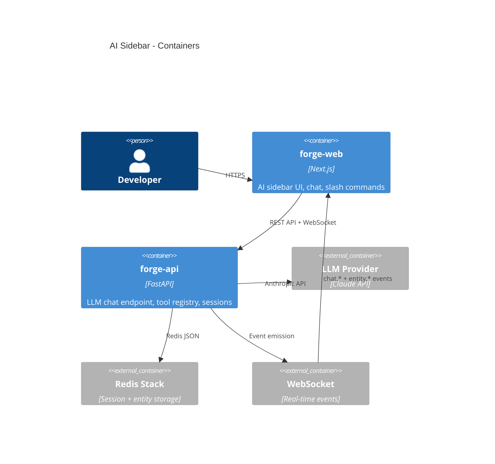
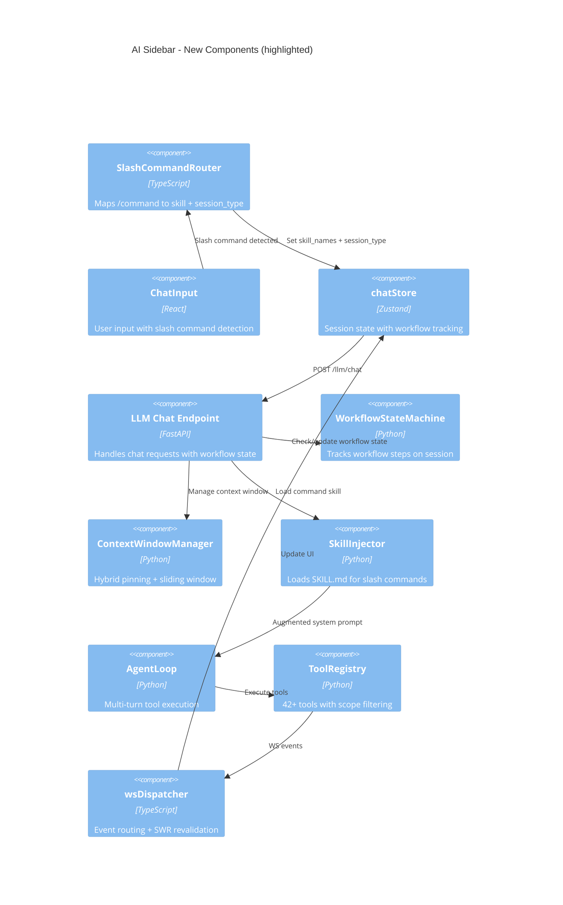

# Architecture: AI Sidebar Entity Management System

## Overview

Extend the existing AI sidebar architecture to achieve full entity management parity with forge-core CLI. The current 4-layer system prompt architecture (app context, entity context, page context, skill context) is sound and proven across 245 completed tasks in forge-platform-v2. The design adds 3 new components: Slash Command Router, Workflow State Machine, and Context Window Manager. All changes are additive - no restructuring of existing components.

## C4 Diagrams

### Context

### Container

### Component (Key Changes)

## Components

| Component | Responsibility | Technology | Interfaces |
|-----------|---------------|------------|------------|
| SlashCommandRouter | Map /command to skill name + session metadata | TypeScript (forge-web) | Input: slash command string. Output: {skillName, sessionType, initialHint} |
| WorkflowStateMachine | Track multi-step workflow progress on session | Python (forge-api) | Input: session + tool call. Output: validation result + next expected step |
| ContextWindowManager | Manage token budget with hybrid pinning | Python (forge-api) | Input: message history. Output: trimmed history within budget |
| EntityCardRenderer | Detect entity refs in messages, render inline cards | TypeScript (forge-web) | Input: message text. Output: React components with entity links |
| ToolCoverageExtension | New archive/remove/create tools for coverage gaps | Python (forge-api) | Input: tool calls. Output: entity mutations |

## Architecture Decision Records

### ADR-1: Slash Command Router (Frontend-Side)
- **Status**: Proposed
- **Context**: Slash commands (/plan, /next, /discover etc.) need to trigger specialized workflow sessions. Currently they just inject text.
- **Decision**: Frontend SlashCommandRouter maps each /command to: skill name (for SKILL.md injection), session_type, and optional initial_hint (first system message guiding the LLM).
- **Alternatives considered**: (1) Backend command parser - rejected because it duplicates frontend detection and couples message parsing to backend. (2) Hard-coded per-command endpoints - rejected because it prevents extensibility.
- **Consequences**: Gains: extensible via skill registry, no backend changes for new commands. Loses: frontend must know command-to-skill mapping (but this is already in SlashCommandDropdown).

### ADR-2: Workflow State Machine (Session-Level)
- **Status**: Proposed
- **Context**: Multi-step workflows (/plan = draft -> review -> approve) need enforcement. LLMs are not state machines and may skip steps.
- **Decision**: Add workflow_state to ChatSession: {workflow_id, current_step, completed_steps[], expected_tools[], allow_deviation}. Agent loop checks expected_tools before execution. Deviation triggers warning, not hard block.
- **Alternatives considered**: (1) Hard state machine blocking non-matching tools - rejected because it prevents legitimate LLM creativity and error recovery. (2) No enforcement, rely on skill instructions only - rejected because LLMs demonstrably skip steps.
- **Consequences**: Gains: reliable multi-step workflows, auditable step completion. Loses: slight complexity in agent loop, possible false warnings on legitimate deviations.

### ADR-3: Context Window Manager (Hybrid Pinning)
- **Status**: Proposed
- **Context**: Multi-turn sessions with tool calls accumulate tokens rapidly. Need to stay within budget while preserving important context.
- **Decision**: Hybrid approach: (1) Pin last N tool results (N=5 by default). (2) Pin session summary (auto-generated after every 10 messages). (3) Sliding window for conversation messages (keep last M messages). (4) Total budget: configurable, default 30k tokens for history.
- **Alternatives considered**: (1) Pure sliding window - rejected because it loses workflow state from earlier tool calls. (2) LLM-based summarization per turn - rejected because it adds latency and cost per message. (3) Pin everything - rejected because it provides no savings.
- **Consequences**: Gains: predictable token usage, preserved workflow context. Loses: conversation nuance from older messages (acceptable tradeoff).

### ADR-4: Entity Inline Cards
- **Status**: Proposed
- **Context**: When LLM references entities (T-001, D-003, O-001) in responses, users should see clickable cards with status/summary, not just plain text IDs.
- **Decision**: Post-processing step in Message.tsx: regex detects entity ID patterns, replaces with EntityCard component that fetches entity summary via SWR and renders inline.
- **Alternatives considered**: (1) LLM returns structured entity blocks - rejected because it requires LLM format compliance and adds to output tokens. (2) Backend post-processes response - rejected because it adds latency and coupling.
- **Consequences**: Gains: rich entity display without LLM changes. Loses: extra SWR requests per entity reference (mitigated by SWR cache).

### ADR-5: Archive/Remove vs Hard DELETE
- **Status**: Proposed
- **Context**: KR-1 requires full CRUD but Forge philosophy is append-only audit trail. Need to handle 'delete' requests without actual data destruction.
- **Decision**: Implement archiveEntity tool (sets status to ARCHIVED/REMOVED) instead of hard DELETE. LLM trained via tool description to use archive semantics. Confirmation step required before archival.
- **Alternatives considered**: (1) Hard DELETE tools - rejected due to data loss risk amplified by LLM tool confusion (Risk-2). (2) No delete capability at all - rejected because it fails KR-1 completeness.
- **Consequences**: Gains: safe entity removal, audit trail preserved. Loses: entities accumulate (mitigated by filtering archived entities from default views).

## Adversarial Findings

| # | Challenge | Finding | Severity | Mitigation |
|---|-----------|---------|----------|------------|
| 1 | STRIDE: Spoofing | LLM could be prompt-injected via entity content displayed in chat | High | Sanitize entity content before including in LLM context. Mark user-generated content. |
| 2 | FMEA: Tool confusion | Wrong tool called -> wrong entity modified -> user frustrated | High | Scope filtering (8-12 tools visible), improved descriptions, entity-type confirmation |
| 3 | Anti-pattern: God object | Session accumulates too many responsibilities (chat + workflow + context + tokens) | Medium | Split concerns: SessionManager (persistence), WorkflowState (steps), ContextManager (tokens) |
| 4 | Pre-mortem: 6 months later | LLM provider changes tool-calling behavior, breaking 95% accuracy | High | Abstract tool execution behind registry. Tool descriptions are the contract, not LLM internals. |
| 5 | Dependency: LLM provider | Single dependency on Claude API for all sidebar functionality | Medium | Text tool adapter already exists for fallback providers. But quality may differ. |
| 6 | Scale: 100x users | 100x concurrent sessions = 100x Redis memory, 100x LLM API calls | Medium | Redis TTL (24h) limits accumulation. LLM calls are per-user, not shared. Cost is linear. |
| 7 | Cost: multi-turn | Average session: 15 turns x 5k tokens = 75k tokens per session | Medium | Token budget per session. Show cost to user. Auto-summarize long sessions. |
| 8 | Ops: debugging | User reports 'AI did the wrong thing' - how to debug? | Medium | Existing debug tab shows full stream. Add tool call audit log per session. |

## Tradeoffs

| Chose | Over | Because | Lost | Gained |
|-------|------|---------|------|--------|
| Skill injection for commands | Hard-coded command handlers | Extensibility, no code changes for new commands | Guaranteed step enforcement | Flexibility, community skills |
| Hybrid context pinning | Full summarization | Simpler, no extra LLM call, predictable | Nuanced conversation recall | Reliable token budget |
| Archive semantics | Hard DELETE | Data safety, audit trail | Clean removal | Recoverability |
| Frontend slash command router | Backend command parser | No backend changes, frontend already detects | Server-side command validation | Faster iteration |
| Soft workflow enforcement | Hard state machine | LLM creativity preserved, error recovery possible | Guaranteed step order | Better UX, fewer false blocks |