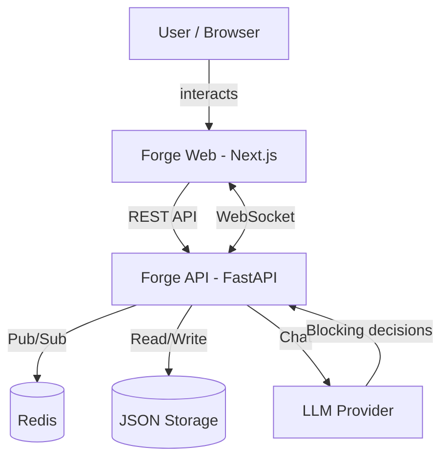
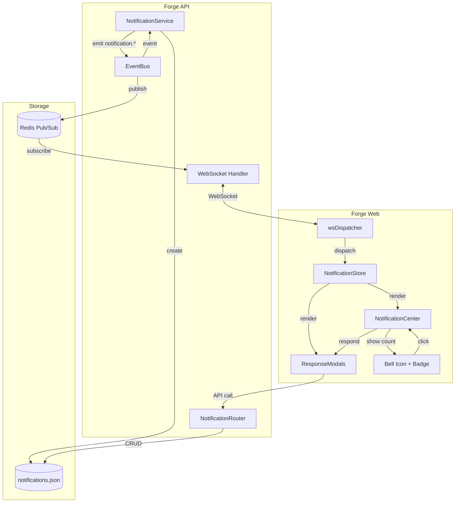
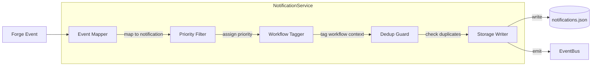

# Architecture: Decision & Notification Infrastructure (O-002)

## Overview

A 6-component notification system built on existing Forge infrastructure (WebSocket + Redis Pub/Sub + StorageAdapter). Enables real-time notification delivery (<500ms) with server-side persistence for zero-miss guarantee. Supports 4 notification types with dedicated response UIs and multi-workflow routing via metadata tagging.

## C4 Diagrams

### Context


### Container


### Component: NotificationService (Backend)


## Components

| Component | Responsibility | Technology | Interfaces |
|-----------|---------------|------------|------------|
| NotificationEntity | Persistent storage schema for notifications | JSON file via StorageAdapter | Read/Write via StorageAdapter |
| NotificationService | Map forge events to notifications, assign priority, dedup | Python module in forge-api | Called by EventBus hooks, calls StorageAdapter + EventBus |
| NotificationRouter | REST API for notification CRUD + bulk operations | FastAPI router | GET/POST/PATCH/DELETE /notifications |
| NotificationStore | Frontend state management for notifications | Zustand via createEntityStore factory | WS events, SWR integration, component subscriptions |
| NotificationCenter | Enhanced bell icon with real-time count + dropdown list | React component | Reads from NotificationStore, links to ResponseModals |
| ResponseModals | Per-type modal dialogs for notification responses | React components (4 types) | Reads notification data, calls API for responses |

### Component Justification

- **NotificationEntity vs reusing decisions**: Notifications have different lifecycle (UNREAD/READ/DISMISSED vs OPEN/CLOSED), different fields (priority, notification_type, response_url), and much higher volume. Separate entity is justified.
- **NotificationService vs inline event handling**: Centralizes event-to-notification mapping logic. Without it, notification creation logic would be scattered across 10+ routers. Single place to add/modify notification rules.
- **NotificationRouter vs extending existing routers**: Notifications need bulk operations (mark-all-read, dismiss-all) and cross-entity queries (all unread across types). Dedicated router keeps this clean.
- **NotificationStore vs extending notificationStore**: Current notificationStore only handles DecisionNotification type. New store handles all notification types with factory pattern, WS integration, SWR support.
- **NotificationCenter vs current**: Current component polls. New component is WebSocket-driven with real-time count badge, priority sorting, workflow grouping.
- **ResponseModals vs navigation**: KR-2 requires dedicated detail views. Modals keep user in context (no page navigation). Each type has unique response UI.

## Data Model

### Notification Entity Schema
```json
{
  "id": "N-001",
  "notification_type": "decision|approval|question|alert",
  "priority": "critical|high|normal|low",
  "status": "UNREAD|READ|DISMISSED|RESOLVED",
  "title": "Blocking decision requires your input",
  "message": "Risk D-045 (HIGH severity) needs mitigation decision",
  "source_event": "decision.created",
  "source_entity_type": "decision|task|objective|idea",
  "source_entity_id": "D-045",
  "project": "forge-web",
  "workflow_id": "exec-001",
  "workflow_step": "discovery",
  "ai_options": [
    {"label": "Accept risk", "action": "accept", "reasoning": "Low impact on timeline"},
    {"label": "Mitigate", "action": "mitigate", "reasoning": "Add circuit breaker"}
  ],
  "response": null,
  "response_at": null,
  "created_at": "2026-03-14T12:00:00Z",
  "resolved_at": null,
  "expires_at": null
}
```

### Notification Types

| Type | Trigger Events | Priority | Response UI | Blocking? |
|------|---------------|----------|------------|----------|
| **decision** | decision.created (type=risk, severity=HIGH+) | critical/high | Decision response modal: severity badge, AI options with reasoning, accept/mitigate/defer buttons | YES |
| **approval** | draft_plan.created, task.needs_review | high/normal | Approval modal: show plan/task summary, approve/reject/modify buttons | YES |
| **question** | chat.paused (needs_input) | high | Question modal: show LLM question, text input for response, context panel | YES |
| **alert** | task.completed, task.failed, gate.failed, workflow.completed | normal/low | Toast + bell count, click to navigate to entity | NO |

### Event-to-Notification Mapping (NotificationService)

| Source Event | Notification Type | Priority Logic | Condition |
|-------------|-------------------|---------------|----------|
| decision.created (type=risk, severity=HIGH) | decision | critical | Always |
| decision.created (type=risk, severity=MEDIUM) | decision | high | Always |
| decision.created (type=exploration) | decision | normal | Only if has open_questions |
| decision.created (other) | decision | normal | If status=OPEN |
| chat.paused | question | high | Always (LLM waiting for input) |
| task.completed | alert | low | Always |
| task.failed | alert | high | Always |
| gate.failed | alert | high | Always |
| workflow.step_completed | alert | normal | Always |
| workflow.completed | alert | normal | Always |

## API Design

### NotificationRouter Endpoints

```
GET    /projects/{slug}/notifications              List (filter: status, type, priority, workflow_id)
GET    /projects/{slug}/notifications/unread-count  Quick count for badge
GET    /projects/{slug}/notifications/{id}          Get single notification
PATCH  /projects/{slug}/notifications/{id}          Update (status: READ, DISMISSED, RESOLVED)
POST   /projects/{slug}/notifications/{id}/respond  Submit response (for blocking notifications)
PATCH  /projects/{slug}/notifications/bulk           Bulk update (mark-all-read, dismiss-all)
DELETE /projects/{slug}/notifications/{id}          Remove notification
```

### WebSocket Events (new)

```
notification.created   - New notification (includes full notification object)
notification.updated   - Status change (read, dismissed)
notification.resolved  - Blocking notification resolved (response submitted)
```

## Architecture Decision Records

| ADR | Decision | Rationale | Tradeoff |
|-----|----------|-----------|----------|
| ADR-1 | Server-side persistence | KR-4 zero-miss requires surviving page refresh/disconnect | More backend code vs guaranteed delivery |
| ADR-2 | Single notification entity | All notification types share 80% of fields | Less type-specific optimization vs simpler code |
| ADR-3 | Response modals over navigation | KR-2 dedicated views without losing workflow context | Modal complexity vs clean UX |
| ADR-4 | Workflow tagging over separate channels | Reuse single WS connection, metadata-based filtering | Frontend filtering overhead vs connection simplicity |

### ADR-1: Server-Side Notification Persistence
- **Status**: Proposed
- **Context**: KR-4 requires zero missed notifications. Current client-only approach (notificationStore + localStorage) loses notifications on page refresh.
- **Decision**: Store notifications in notifications.json via StorageAdapter, same pattern as all other Forge entities.
- **Alternatives**: (a) Client-only with localStorage (insufficient for KR-4), (b) Redis Streams (new pattern, overkill for v1), (c) PostgreSQL (Phase 2 storage, not available yet)
- **Consequences**: Gain: zero-miss guarantee, audit trail, cross-session persistence. Lose: additional file I/O, entity locking overhead.

### ADR-2: Single Unified Notification Entity
- **Status**: Proposed
- **Context**: 4 notification types (decision, approval, question, alert) could be separate entities or one unified entity.
- **Decision**: Single notification entity with notification_type field. AI options and response stored as JSON within the notification.
- **Alternatives**: (a) Separate entities per type (DecisionNotification, ApprovalNotification, etc.), (b) Extend existing entities (add notification fields to decisions, tasks)
- **Consequences**: Gain: single store, single router, unified query/filter. Lose: some type-specific fields are nullable (ai_options only for decision/approval).

### ADR-3: Response Modals Over Page Navigation
- **Status**: Proposed
- **Context**: KR-2 requires dedicated detail views with AI-proposed options. Could navigate to entity page or show modal.
- **Decision**: Use modal dialogs for blocking notifications (decision, approval, question). Non-blocking (alert) use toast + bell link to entity page.
- **Alternatives**: (a) Always navigate to entity page (loses context), (b) Inline expansion in notification dropdown (cramped), (c) Full notification drawer panel (competes with AI sidebar)
- **Consequences**: Gain: user stays in workflow context, dedicated response UI. Lose: modal management complexity, potential modal-on-modal issues.

### ADR-4: Workflow Metadata Tagging
- **Status**: Proposed
- **Context**: KR-3 requires correct notifications across concurrent workflows. Need to route/group notifications by workflow context.
- **Decision**: Add workflow_id and workflow_step fields to all notifications. Frontend groups/filters by these fields. Single WebSocket connection per project unchanged.
- **Alternatives**: (a) Separate WS channel per workflow (connection overhead), (b) Server-side filtering (backend must track user focus), (c) No grouping (all notifications in one stream)
- **Consequences**: Gain: simple, no infrastructure changes, clean grouping. Lose: frontend must implement filter/group logic.

## Adversarial Findings

| # | Challenge | Finding | Severity | Mitigation |
|---|-----------|---------|----------|------------|
| 1 | STRIDE: Spoofing | Notification API needs auth - unauthenticated user could dismiss others notifications | Medium | JWT auth on all notification endpoints (existing pattern) |
| 2 | FMEA: NotificationService crash | If event-to-notification mapping throws, source event still processed but notification lost | Medium | Wrap mapping in try/catch, log error, emit metric. Notification is non-critical path. |
| 3 | Anti-pattern: Notification fatigue | Too many low-priority notifications trains users to ignore all notifications | High | Priority-based display: only critical/high get popup. Low = bell count only. Configurable thresholds later. |
| 4 | Pre-mortem: 6 months later | Notification types grew to 20+, each needing custom modal. Maintenance burden high. | Medium | Base modal component with pluggable content. Type registry pattern. New type = new content component only. |
| 5 | Dependency: WebSocket single point | If WebSocket disconnects, no real-time notifications. Fallback needed. | High | Fetch-on-reconnect + periodic poll fallback (every 60s if WS disconnected). Server persistence ensures nothing lost. |
| 6 | Scale: 100x notifications | 100 concurrent notifications overwhelm both file I/O and UI | Medium | Server-side batching (max 1 write per 500ms), frontend notification queue with max visible limit (already have max 3 toasts pattern). |
| 7 | Cost: Storage growth | notifications.json grows indefinitely | Low | Auto-archive resolved notifications older than 30 days. Keep only unread + last 100 resolved. |
| 8 | Ops: Debugging notification issues | User reports missed notification. How to diagnose? | Medium | Notification entity has created_at, source_event, status history. EventBus logs all emissions. Full audit trail. |

## Tradeoffs

| Chose | Over | Because | Lost | Gained |
|-------|------|---------|------|--------|
| Server-side persistence | Client-only storage | KR-4 zero-miss guarantee | Simplicity of no backend | Reliability, audit trail, cross-session |
| Single entity | Per-type entities | 80% field overlap, single query surface | Type-specific optimization | Simpler code, unified API |
| Modals | Page navigation | Keeps workflow context | Full-page detail views | No context switching |
| Workflow tags | Separate channels | Reuse existing WS | Clean channel isolation | Simpler infrastructure |
| Priority queue | Show-all | Prevents notification fatigue | Users see everything immediately | Better UX under load |