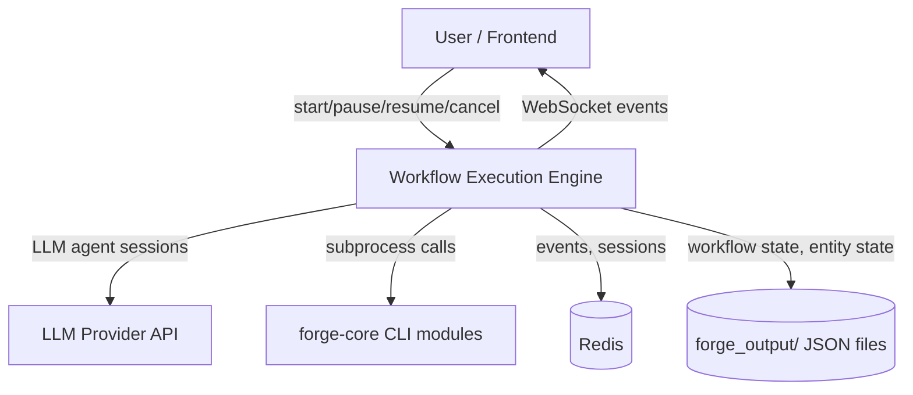
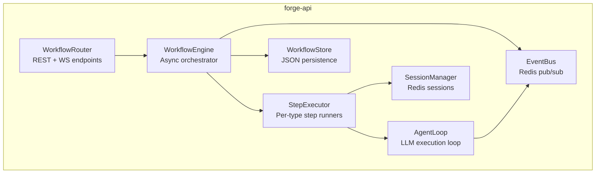
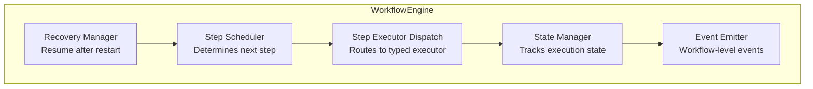

# Architecture: Workflow Execution Engine

## Overview

The Workflow Execution Engine orchestrates multi-step AI processes (objective -> discover -> plan -> execute tasks -> compound) as persistent, pausable, resumable processes. It coordinates forge-core commands via LLM agent sessions, manages step transitions, handles user decision gates, and emits real-time WebSocket events.

## C4 Diagrams

### Context


### Container


### Component: WorkflowEngine


## Components

| Component | Responsibility | Technology | Interfaces |
|-----------|---------------|------------|------------|
| WorkflowDefinition | Schema for step DAG (types, deps, conditions) | Pydantic models | JSON serialization |
| WorkflowEngine | Orchestrates execution: schedule, dispatch, transition | asyncio.Task per execution | start(), pause(), resume(), cancel() |
| StepExecutor | Per-type step runners | AgentLoop, subprocess, asyncio | execute_step(step, context) -> StepResult |
| WorkflowStore | Persistence for workflow state | JSON files in forge_output/ | save(), load(), list() |
| WorkflowRouter | REST + WS endpoints | FastAPI | /workflows/ CRUD + /ws/workflow/ stream |
| WorkflowEvents | Event types for frontend | EventBus integration | workflow.started, .step_completed, .paused, etc. |

## Data Model

### WorkflowDefinition
```python
@dataclass
class StepDefinition:
    id: str                          # e.g., 'discover'
    name: str                        # Human-readable
    type: StepType                   # llm_agent | forge_command | user_decision | conditional | parallel_group
    description: str                 # What this step does
    # LLM agent config
    prompt_template: str | None      # System prompt for this step
    scopes: list[str] | None        # Tool scopes for this step
    max_iterations: int = 15         # AgentLoop limit
    # forge_command config
    command_template: str | None     # e.g., 'py -m core.pipeline approve-plan {project}'
    # user_decision config
    decision_prompt: str | None      # What to ask the user
    blocking: bool = True            # Must user respond before continuing?
    # Routing
    next_step: str | None            # Default next step
    on_success: str | None           # Next step on success (overrides next_step)
    on_failure: str | None           # Next step on failure
    on_pause: str | None             # What to do if paused
    conditions: list[Condition] | None  # Conditional routing rules
    # parallel_group
    parallel_steps: list[str] | None # Steps to run concurrently
    join_strategy: str = 'all'       # all | any | majority

@dataclass
class WorkflowDefinition:
    id: str                          # e.g., 'full-lifecycle'
    name: str                        # 'Full Objective Lifecycle'
    description: str
    steps: list[StepDefinition]
    initial_step: str                # First step ID
    version: str = '1.0'
```

### WorkflowExecution (persisted state)
```python
@dataclass
class StepResult:
    step_id: str
    status: str                      # pending | running | completed | failed | skipped
    started_at: str | None
    completed_at: str | None
    output: dict | None              # Step-specific output (entity IDs created, etc.)
    session_id: str | None           # LLM session for this step (for context continuity)
    error: str | None
    decision_ids: list[str]          # Decisions created during this step
    retries: int = 0

@dataclass
class WorkflowExecution:
    id: str                          # WE-001
    workflow_id: str                 # Reference to definition
    project: str                     # Project slug
    objective_id: str | None         # Linked objective
    status: str                      # pending | running | paused | completed | failed | cancelled
    current_step: str | None         # Current step ID
    step_results: dict[str, StepResult]  # Step ID -> result
    pause_reason: str | None         # Why paused (decision_id, user_request, etc.)
    variables: dict                  # Workflow-level variables (passed between steps)
    created_at: str
    updated_at: str
    completed_at: str | None
    error: str | None
```

## Step Types

### 1. llm_agent
Runs an AgentLoop session with configured prompt, tools, and scopes.
- Creates or resumes a ChatSession via SessionManager
- Injects workflow context (previous step outputs, objective info)
- Runs AgentLoop.run() with streaming events
- On blocking decision: pauses workflow, emits workflow.paused
- On completion: extracts output, stores in step_results

### 2. forge_command
Executes a forge-core command as subprocess.
- Templates command with workflow variables (project, task_id, etc.)
- Captures stdout/stderr
- Parses output for entity IDs (T-001, D-003, etc.)
- Stores parsed output in step_results

### 3. user_decision
Pauses workflow and waits for user input.
- Creates a notification via EventBus
- Sets workflow status to 'paused'
- On user response: stores decision, resumes workflow
- Supports: approve/reject, select from options, free text

### 4. conditional
Routes to different next steps based on conditions.
- Evaluates conditions against step_results and variables
- Conditions: step_status, variable_value, decision_severity, entity_count
- Example: if discover found HIGH risk -> go to risk_review, else -> plan

### 5. parallel_group
Runs multiple steps concurrently.
- Launches asyncio tasks for each parallel step
- Join strategy: all (wait for all), any (first success), majority
- Collects results into parallel_results variable

## Architecture Decision Records

### ADR-1: JSON File Persistence (not Postgres)
- **Context**: Need durable workflow state that survives server restarts
- **Decision**: Use JSON files in forge_output/{project}/workflows.json
- **Alternatives**: Postgres (durable but adds infrastructure), Redis-only (fast but volatile), SQLite (embedded DB)
- **Consequences**: Gain: zero new dependencies, consistent with all other forge state. Lose: no concurrent-safe writes without file locking (but forge-core already handles this pattern).

### ADR-2: AgentLoop Reuse (not new LLM integration)
- **Context**: Each LLM step needs streaming, tool execution, pause/resume
- **Decision**: Reuse existing AgentLoop as-is for per-step LLM execution
- **Alternatives**: New LLM runner (clean but duplicates work), LangGraph (external dep)
- **Consequences**: Gain: proven streaming, tool execution, safety limits. Lose: must work within AgentLoop's API (which is fine — it's well-designed).

### ADR-3: Subprocess for forge-core (not direct import)
- **Context**: Workflow engine needs to call forge-core commands
- **Decision**: Use subprocess (py -m core.XXX) for forge-core integration
- **Alternatives**: Direct Python import (faster but tight coupling), REST API wrapping (over-engineering)
- **Consequences**: Gain: clean separation, same interface as CLI, no import side effects. Lose: subprocess overhead (~100ms per call, acceptable for workflow steps).

### ADR-4: asyncio.Task per Execution (not thread pool)
- **Context**: Need to run 3+ concurrent workflows
- **Decision**: Each WorkflowExecution runs as an asyncio.Task
- **Alternatives**: ThreadPoolExecutor (heavier, GIL concerns), ProcessPool (too heavy), Celery (overkill)
- **Consequences**: Gain: lightweight, native async, easy cancellation. Lose: must keep all I/O async (which forge-api already does).

### ADR-5: Step-Level Sessions (not single workflow session)
- **Context**: Should each step have its own LLM session or share one?
- **Decision**: Each LLM step gets its own ChatSession (but can reference previous step outputs)
- **Alternatives**: Single session (context overflow risk), Shared session with pruning (complex)
- **Consequences**: Gain: clean context per step, no token overflow, each step focused. Lose: no automatic conversation continuity (mitigated by injecting previous step summaries as context).

## Adversarial Findings

| # | Challenge | Finding | Severity | Mitigation |
|---|-----------|---------|----------|------------|
| 1 | FMEA: JSON file corruption | Concurrent writes could corrupt workflows.json | Medium | Use atomic write pattern (write to .tmp, rename) — forge-core already does this |
| 2 | Pre-mortem: Workflow stuck forever | Step fails silently, no timeout, workflow hangs | High | Per-step timeout (configurable, default 10min), workflow-level timeout (default 2hr) |
| 3 | FMEA: Server restart mid-step | LLM call in progress when server crashes | Medium | On recovery, check step status — if 'running' with no completion, mark as 'failed' and offer retry |
| 4 | Scale: 10+ concurrent workflows | Memory pressure from 10+ AgentLoop instances | Low | AgentLoop is lightweight (async), limit concurrency to configurable max (default 5) |
| 5 | Dependency: Redis down | EventBus and SessionManager both require Redis | High | Redis is already a hard dependency — add health check, graceful degradation for events |
| 6 | Anti-pattern: God object | WorkflowEngine doing too much | Medium | Split into Scheduler, StateManager, StepDispatcher — each with single responsibility |
| 7 | STRIDE: Unauthorized workflow control | User could start/cancel another user's workflow | Low | Scope-based auth already in place via session scopes |
| 8 | Ops: Debugging failed workflows | Hard to diagnose why a step failed | Medium | Comprehensive event logging, step-level error capture, session_id linkage for full LLM history |

## Key Integration Points

1. **forge-api/app/llm/agent_loop.py** — Reuse for per-step LLM execution
2. **forge-api/app/events.py** — Add workflow.* event types
3. **forge-api/app/routers/execution.py** — Extend or replace with workflow endpoints
4. **forge-api/app/llm/session_manager.py** — Per-step session creation and recovery
5. **forge-api/app/llm/context_resolver.py** — Add 'workflow' context type
6. **forge-api/app/llm/tool_registry.py** — Per-step scope restriction

## New Files to Create

1. `forge-api/app/workflow/engine.py` — WorkflowEngine class
2. `forge-api/app/workflow/definitions.py` — WorkflowDefinition, StepDefinition models
3. `forge-api/app/workflow/store.py` — WorkflowStore (JSON persistence)
4. `forge-api/app/workflow/steps.py` — StepExecutor implementations
5. `forge-api/app/workflow/events.py` — Workflow event types
6. `forge-api/app/routers/workflows.py` — REST + WS endpoints
7. `forge-web/stores/workflowStore.ts` — Frontend workflow state
