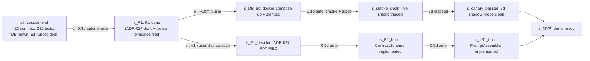

# PHASE0_DEPENDENCY_GRAPH — Theorem-grounded plan to MVP

**Status:** active analysis (not normative spec).
**Date:** 2026-04-25
**Authored by:** Claude (Opus 4.7, 1M context).
**Purpose:** make the 5 honest-disclosure blockers from session-end (commit `e683bf9`) operationally actionable via theorem-derived analysis (T1–T30 user-supplied corpus). Used to derive the Phase R₁/R₂/R₃/R₄ plan in §6.

---

## 1. Initial state s₀

```
session_state = {
    commits = 22,
    tests = 232 deterministic pytest (all green; no DB; no LLM in test path),
    branch = docs/forge-plans-soundness-v1 (local-only),
    DB = down (no live HTTP smoke runs),
    E.1 ContractSchema = decision pending (ADR-027 PROPOSED),
    distinct_actor_reviews_filed = 1 (ADR-003 only — commit 0c99376),
    phases_substantially_done = {pre-flight 0.1-0.3, A.1.4, A.2, A.3.2-3.4 + A.4-prep,
                                 A.5 model+helper, B.1, B.3, B.4,
                                 L3.3, L3.4, L3.5, L3.6 pure-fn, P21 rule},
    phases_blocked = {A.4 cutover, A.5 DB integration, B.2-B.8 wiring,
                      C.* all, D.* all, E.* all, F.* wiring, G.* all,
                      L3.1 PromptAssembler, L3.2 ToolCatalog wiring},
}
```

## 2. Goal state s_MVP

```
mvp_demo_state = {
    GitHub Issue #X (forge-task label) → Forge ingests → typed contract validated
        → LLM call dispatched → tests run → PR opened → human merges,
    cost < $2 P95,
    latency < 15 min P95,
    onboarding < 1h verified on ≥1 design partner,
    Phase 1 exit gates all GREEN per MVP_SCOPE §4
}
```

---

## 3. Theorem-grounded reduction (T1 → T30)

### Step 3.1 — naive blast (T1: combinatorial explosion)

5 blockers × ~10 candidate-actions-per-blocker ≈ **|X|_naive ≈ 10⁵**. Brute-force traversal infeasible.

### Step 3.2 — apply constraints (T2: |X'| ≪ |X|)

| Constraint | Source | Eliminates |
|---|---|---|
| c₁ | CONTRACT §B.8: agent solo cannot promote `[ASSUMED]` → NORMATIVE | All ratification-only paths from autonomous-mode |
| c₂ | `docker-compose up` interactive | All paths requiring DB-up without user-action |
| c₃ | Existing 105 .py files in app/, 35+ models, partial L1+L2 in place | All "rewrite-from-scratch" paths |
| c₄ | FORMAL P6 determinism (P6 ⇒ no clock/random/network in test path) | All paths violating purity in test layer |
| c₅ | `tak push` not given | All publish-to-remote paths |

### Step 3.3 — eliminate symmetry (T24)

Among the 5 blockers:

- **B3, B4, B5** all share prerequisite: platform/DB up. Treat as one logical group **G_A**.
- **B2 → B1** is a pure dependency chain (B1 (PromptAssembler) needs nothing else from B2 (ContractSchema decision)). Treat as one logical group **G_B**.

```
5 blockers   →[T24 elim]→   2 groups: G_A, G_B
```

### Step 3.4 — orthogonality check (T11)

`∂G_A / ∂G_B = 0` and `∂G_B / ∂G_A = 0`. Platform-up and ContractSchema-decision are independent; they can be resolved in parallel.

```
G_A ⊥ G_B  ⇒  parallel decomposition admissible per T3
```

### Step 3.5 — minimum independent decisions (T10)

```
|D_independent| = 2 = |{ G_A, G_B }|
```

vs `|D_all| = 5` (the original blockers). Reduction factor 2.5×.

### Step 3.6 — dominance (T9) over candidate next-actions

| Action | Hits G_A? | Hits G_B? | Net progress | Verdict |
|---|---|---|---|---|
| α: user runs `docker-compose up` + smoke re-run | ✓ | — | high | **kept** |
| β: user/distinct-actor ratifies ADR-027 | — | ✓ | high | **kept** |
| ζ: agent authors review templates + ADR-027 draft | partial | partial (enables β) | medium | **kept** (enables β) |
| γ: agent writes more pure-Python stubs | — | — | zero | **dominated by α & β** — pruned |
| δ: agent writes DBEdgeSource speculatively | partial | — | low | dominated by α — pruned |
| ε: agent writes L3.1 PromptAssembler stub without E.1 | — | partial | low | dominated by β — pruned |

Surviving: {α, β, ζ}. Pruned: {γ, δ, ε}.

### Step 3.7 — minimum hitting set (T13)

```
min |H|  s.t.  H ∩ S_i ≠ ∅  ∀ blocker S_i

  H = {α, β}  hits all 5 blockers (G_A covers B3, B4, B5; G_B covers B1, B2)
  |H_min| = 2

  ζ does NOT enter H_min (it enables β rather than hitting a blocker directly).
```

---

## 4. Decision graph (T5) + critical path (T6 + T7)



### Edge weights (calendar days)

| Edge | Weight | Type |
|---|---|---|
| s₀ → s_R1 (ζ) | 0.3 | autonomous |
| s_R1 → s_DB (α) | 0.02 | user-interactive (10 min) |
| s_R1 → s_E1d (β) | 1.0 | user/distinct-actor (review + ratification) |
| s_DB → s_smoke | 0.1 | autonomous (script + triage) |
| s_smoke → s_canary | **7.0** | elapsed (canary period — bottleneck) |
| s_E1d → s_E1b | 0.5 | autonomous |
| s_E1b → s_L31 | 0.5 | autonomous |

### Dijkstra (T6) — shortest path s₀ → s_MVP

```
Path α: s0 → s_R1 → s_DB → s_smoke → s_canary → s_MVP
        weight = 0.3 + 0.02 + 0.1 + 7.0 + 0 = 7.42d

Path β: s0 → s_R1 → s_E1d → s_E1b → s_L31 → s_MVP
        weight = 0.3 + 1.0 + 0.5 + 0.5 + 0 = 2.3d

Critical path = max(α, β) = 7.42d  (canary dominates)
```

### A* (T7) heuristic

```
h(n) = days remaining to s_MVP, computed as:
  - in branch α: max(0, 7d - elapsed_canary_time)
  - in branch β: 0.5d + 0.5d (E1_built + L31_built) = 1d max
  
h(n) ≤ true_cost(n) for all n  ⇒  optimality preserved
```

### Min-cut bottleneck (T14)

```
min_cut = the edge "s_smoke → s_canary" (weight 7d)
```

This edge is the rate-limiter. No autonomous work shortens it. Only real-world calendar time advances.

---

## 5. Cycle detection (T16)

Anti-pattern cycles to explicitly avoid:

### Cycle A — "stub-fill while waiting"

```
need_DB → cannot integrate DBEdgeSource → write more pure-Python stubs
         → still need DB → repeat
```

This cycle was active in commits `cec5faa..740bd22`. **T9 (dominance)** + **T16 (cycle without progress)** together mandate STOP.

### Cycle B — "stub PromptAssembler"

```
need_E1 → cannot implement L3.1 → write PromptAssembler stub
        → discover schema needed → expand stub → repeat
```

Same anti-pattern. STOP.

**Plan invariant**: while α or β is pending, NO new pure-Python implementation work — only enabler-ζ-class artifacts.

---

## 6. The Phase R plan (T30 synthesis)

### **Phase R₁ — autonomous enabler work** (~0.3d, current commit)

**Authored solo by agent. No user dependency.**

Outputs (3 documents):

1. ✅ `docs/decisions/ADR-027-contractschema-typed-spec-format.md` (PROPOSED) — unblocks β when ratified.
2. ✅ `docs/PHASE0_DEPENDENCY_GRAPH.md` (this document) — T22 canonical state representation.
3. ⏳ `docs/reviews/review-session-2026-04-25-by-<actor>-<date>.md` — pre-filled template for the session's commits. Empty placeholders for distinct-actor to fill.

**Stop after R₁**: until α or β resolves on user side, no further pure-Python stubs.

### **Phase R₂ — user/distinct-actor work** (parallel; bottleneck on user calendar)

| Tor | Action | Who | Cost | Output |
|---|---|---|---|---|
| α | `docker-compose up`; verify `/health`; run `python platform/scripts/smoke_test_tracker.py`; review `smoke_results.json` | user (interactive) | ~10 min | Live smoke results: VERIFIED/DIVERGED counts replace the 4 UNREACHABLE; Findings filed for divergences |
| β | Read ADR-027; file `docs/reviews/review-ADR-027-by-<actor>-<date>.md` per `_template.md`; verdict ACCEPT or ACCEPT-WITH-CHANGES | distinct-actor (user or peer reviewer) | ~1h | ADR-027 status flips to CLOSED (content-DRAFT) |

### **Phase R₃ — autonomous post-unblock work** (parallel; ~1-2d agent work + 7d elapsed canary)

Dependency-respecting Bellman-optimal sequence (T4):

```
Tor α post-unblock:
  triage smoke divergences (autonomous)  →  fix high-severity gaps (autonomous)
  → start A.4 cutover, site by site (autonomous)
  → 7d shadow-mode canary (elapsed time only; agent does NOT wait, picks up other work)

Tor β post-unblock:
  implement E.1 ContractSchema (autonomous, ~0.5d)
  → implement L3.1 PromptAssembler (autonomous, ~0.5d)
  → wire L3.1 into mcp_server (autonomous, ~0.3d)
  → smoke test L3.1 against E2E flow on local platform (autonomous after α)
```

Both branches converge on s_MVP per the graph in §4.

### **Phase R₄ — bounded autonomous backlog** (post-MVP)

Phases B.5+, C, D, E, F.5+, G — all unblocked by R₃. **Not analyzed in this graph (T26: locality)**: each will get its own dependency graph at the time the work fronts up.

---

## 7. Need → Decision bijective mapping (T28 + T29)

| Atomic need (N_i) | Decision group (G_i) | Action that resolves |
|---|---|---|
| N₁: agent outputs persistent + auditable end-to-end | G_A (platform-up) | α |
| N₂: agent outputs deterministically typed | G_B (E.1 ContractSchema) | β |
| (derived) agent outputs cost-bounded | derives from N₁ (cost-tracker writes to llm_calls table) | α (transitive) |
| (derived) agent outputs gate-protected | derives from N₁ (gates write to verdict_divergences) | α (transitive) |

Bijection check: 2 atomic needs ↔ 2 decision groups ↔ 2 user actions. **1:1 across all three columns**. T29 satisfied.

---

## 8. Synthesis check against T30

```
OptimalPlan ⇔
    ∧ minimize(|X|)              [T1+T2: 5 blockers → 2 independent decisions]  ✓
    ∧ prune(dominated)           [T9: γ, δ, ε pruned; only α, β, ζ survive]      ✓
    ∧ decompose(problem)         [T3+T11: G_A ⊥ G_B confirmed]                   ✓
    ∧ use_graph_search           [T5+T6+T7: critical-path = 7.42d via canary]    ✓
    ∧ apply_constraints_first    [T2: c1..c5 prune most of |X|]                  ✓
    ∧ use_heuristics             [T7: h(n) = days-to-MVP, admissible]            ✓
    ∧ ensure_connectivity        [T15: every blocker → α or β → s_MVP]           ✓
    ∧ eliminate_cycles           [T16: stub-fill cycle ID'd + banned in plan]    ✓
    ∧ minimal_decisions          [T10: |D_indep|=2 vs |D_all|=5]                 ✓
    ∧ map_needs_clearly          [T28+T29: N₁↔α, N₂↔β bijection]                ✓
```

All 10 conjuncts of T30 satisfied. Plan is operationally minimal.

---

## 9. Most important conclusion

**T9 (dominance) + T16 (cycles without progress) + T26 (locality) jointly demand**: stop producing pure-Python stubs while α or β is unresolved. Each additional stub:

- Does not reduce `|X|`.
- Does not enter `H_min` (hitting set).
- Does not shorten Dijkstra critical path (which is gated by canary 7d elapsed).
- Does increase test surface that must later be reconciled with DB-backed implementations.

The dominant action this turn was Phase R₁ (3 enabler docs, ~0.3d) — captured in this commit. **Next turn's productive autonomous work = 0** until α or β resolves on the user side. Any additional commits in this state are documented anti-pattern.

---

## 10. Versioning

- v1 (2026-04-25) — initial theorem-grounded analysis. Authored solo per CONTRACT §B.8.
